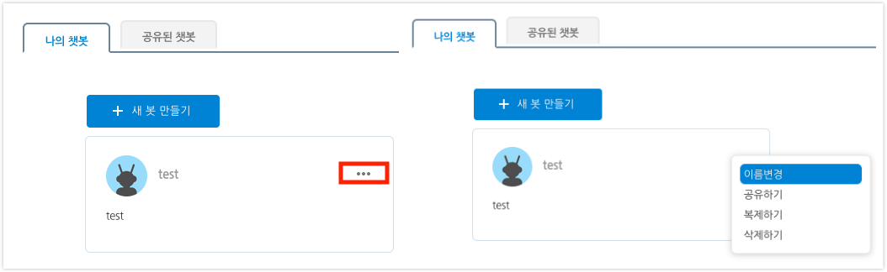
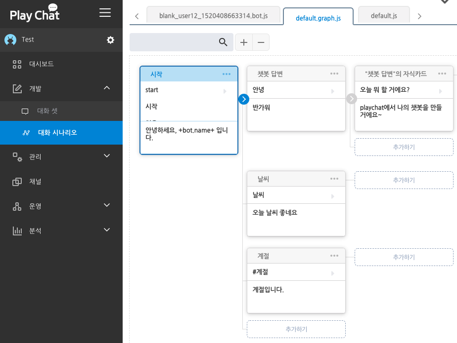
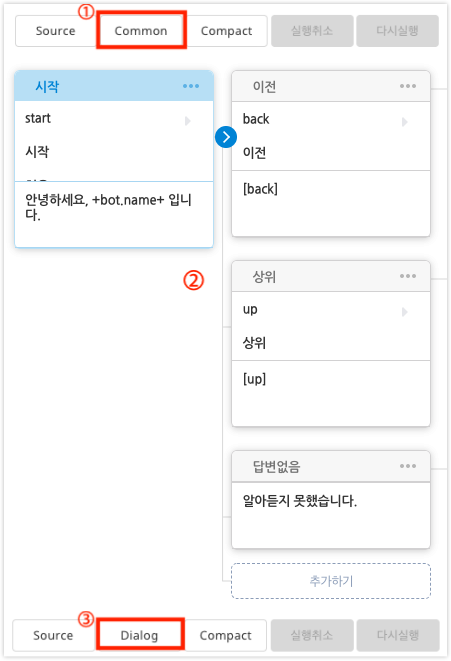
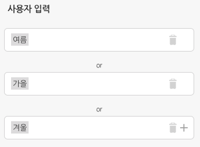
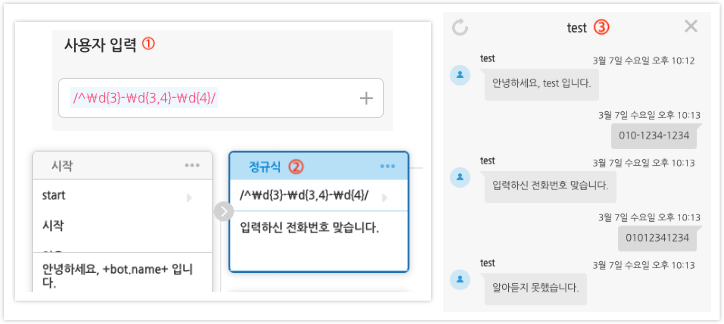
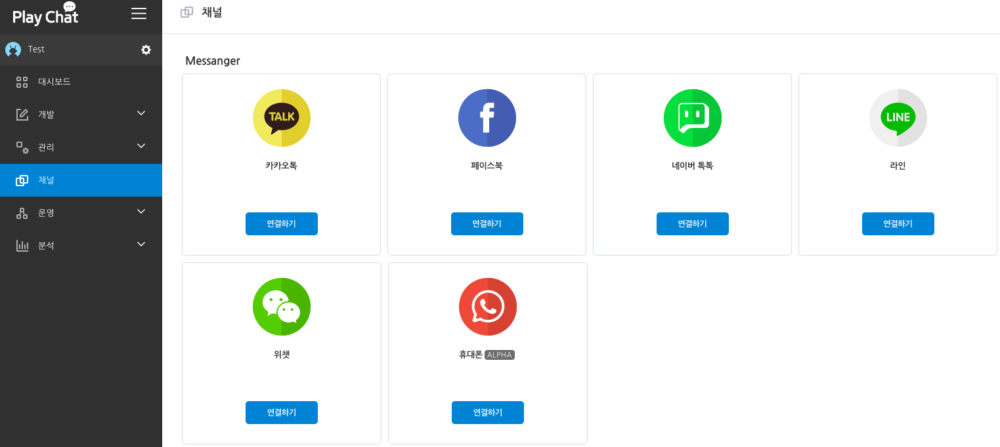

# Playchat文档  
---
## 目录  
* 入门  
	* 10分钟, 制作聊天机器人  
	* 基本概念  
* 概述  
	* 聊天机器人  
		* 制作  
		* 信息修改  
		* 复制  
		* 分享  
		* 删除  
	* 对话场景  
		* 开发  
			1. 卡片  
			2. 用户输入  
			3. 回答前执行的函数  
			4. 聊天机器人回答  
		* 管理  
	* 对话集  
		* 开发  
			1. 基本对话集  
			2. 添加对话集  
		* 管理  
	* 频道    
		* Kakao Talk  
		* Facebook  
		* Naver Talk Talk  
		* Line  
		* 微信  
	* 运营    
		* 用户  
		* 对话  
	* 分析  
		* 用户  
		* 对话  
	* 测试  
		* 对话窗口  
		* 实时对话分析  

* 优秀案例
	* 对话场景创建指南
	* 回答前执行函数指南


----------

## 开始  
### 制作聊天机器人  

### 理解聊天机器人  


## 概述  

### 聊天机器人  
您可以在聊天机器人管理页面对聊天机器人进行创建，编辑和删除。  

#### 制作  

您可以按照以下步骤来创建聊天机器人。

1. 如果您还没有到“聊天机器人管理”页面，请打开Playchat后单击主页上的‘免费开始’按钮。  
2. 在"聊天机器人管理"页面点击创建新机器人按钮。   

3. 请选择空白机器人，功能指南机器人，业种别机器人中的一种来创建聊天机器人。

4. 在“创建聊天机器人”页面中输入名称，说明，头像，语言来创建新的聊天机器人。
	- 名称 : 不可与Playchat中的其他聊天机器人名重复的唯一名称，可用来识别聊天机器人，是其他人可以看到的部分。字数限制在30字以内。    
	- 说明 : 填写聊天机器人的简要说明。字数限制在100字以内。    
	- 头像 : 上传聊天机器人的头像。是向Playchat的其他用户展示的头像。  
	- 语言 : 请从英语，中文，韩语中选择聊天机器人的语言环境。  
生成的聊天机器人后会以卡片的形式出现在聊天机器人管理画面。    
  

* 分类
可以从空白机器人，功能指南机器人，业种别机器人等三种机器人中选择一种来创建聊天机器人。   

	* 空白机器人   
空白机器人是只有开始卡片的白纸状态聊天机器人。  

	* 功能指南机器人  
功能指南机器人是用来简单说明在制作聊天机器人时，可以使用并会用到的功能（实体，意图等）。 您可以参考“制作聊天机器人”指南来使用。   

	* 样品聊天机器人
样品聊天机器人是针对不同业务，使用其需要的功能后，构建成的针对性样品聊天机器人，是为了让您在参考后能轻松地制作出可以完成各种不同业务的聊天机器人。    

* 个数限制  
在Playchat上能无限次的制作聊天机器人，所以快来多多创建您的聊天机器人吧。  

#### 信息修改
您如果想修改聊天机器人的姓名，说明，头像，语言等信息可以点击您想修改的聊天机器人卡片的右上角的按钮，然后在下拉菜单中点击选择修改。  


#### 复制
您可以通过聊天机器人卡片右上角的下拉菜单中的复制按钮对聊天机器人进行克隆。  

#### 分享
您可以通过聊天机器人卡片右上角的下拉菜单中的分享按钮将聊天机器人分享给他人。  

#### 删除
您可以通过聊天机器人卡片右上角的下拉菜单中的删除按钮将当前聊天机器人删除。  

### 场景对话
场景对话是一个树形场景框图，是一种方便用户开发和编辑聊天机器人的工具。场景对话是以*.graph.js形式的文件保存的，Task以*.js文件的形式进行保存。您可以通过点击页面左方导航中的“开发”->“场景对话”来使用场景对话。

#### 开发


1. 卡片
您可以发现场景对话页面是由长方形的盒子连接而成，这个长方形的盒子被称为**卡片**。一个**卡片**由基本的卡片名称，用户输入，聊天机器人回答，回答前执行的函数构成。如果您双击**卡片**页面的右方将出现卡片编辑框。    


 * 卡片名称
**卡片名称**指的是这个卡片的名字，不能与其他卡片名称重复，因为它用来识别卡片。卡片名称主要用在对话流动控制的控制功能上。  

 * 用户输入
**用户输入**是指在执行当前卡片时需要的条件信息（预想的聊天机器人用户的输入）。例如**用户输入**是“您好”，当聊天机器人用户输入“您好”的瞬间，就会执行当前的卡片。即，聊天机器人会进行相应的回答。  

* 回答前执行的函数 

* 聊天机器人回答
**聊天机器人回答**是当卡片执行后，聊天机器人要回答的部分。例如**聊天机器人回答**是“见到您很高兴”，在执行当前卡片时聊天机器人会给出“见到您很高兴”的回答。  


* 父母卡片和子女卡片，以及兄弟卡片
父母卡片和子女卡片是被用来表示直接连接在一起的卡片之间关系的用语。一张卡片可以有一张父母卡片和多张子女卡片。例如，开始卡片右边直接连接的所有卡片都是开始卡片的子女卡片，他们的父母卡片都是开始卡片。同时，拥有同一张父母卡片的卡片之间被互相称为兄弟卡片。
  

* 深度
**深度**代表着卡片的世代。例如对于开始卡片的世代，即深度是0，而开始卡片的子女卡片们的深度都是1。
子女卡片是在父母卡片的深度基础上增加1。  

* 光标
 **光标**是用来标示聊天机器人等待用户输入时的当前卡片（或者最后执行到的卡片）的用语。例如开始卡片执行后，等待用户输入时，光标就在开始卡片上。
当有用户输入时，光标就会移动。
光标的移动可以被看做对话流动。
对话流动（光标的移动）普通是从父母卡片像子女卡片移动。但是使用聊天机器人回答中的对话流动控制控制时，就可以实现直接跳到其他的对话。
  

* 搜索，匹配和运行  
	* **搜索**是查找聊天机器人用户输入的值和当前卡片的子女卡片的"用户输入"是否一致的行为。例如聊天机器人用户输入了"您好"时，查找"用户输入"是"您好"的子女卡片被称为**搜索**。  
  
		* 搜索是按照顺序进行的，从最上面的子女卡片开始往下进行搜索。换句话说，是从第一个子女卡片的聊天机器人用户输入值开始进行匹配，不匹配时就开始判断第二个子女卡片是否匹配。因此请记住对于有着相同**用户输入**的子女卡片，会最先匹配靠上面的卡片。  
		* 搜索时共同卡片比一般卡片更先进行匹配。光标的位置对其没有任何影响，先搜索共同卡片然后再搜索一般卡片。  
	* **匹配**是找到符合聊天机器人用户输入值的子女卡片。  
	例如聊天机器人用户输入"您好"时，找到了"用户输入"是"您好"的子女卡片时被称为**匹配**。
	* **执行**时聊天机器人用户的输入值和特定的卡片的用户输入匹配成功，然后聊天机器人进行回答。
	例如聊天机器人用户输入"您好"时，匹配成功的"用户输入"是"您好"的卡片会回答"聊天机器人回答"，这个卡片就被**执行**了。  
	执行这了这个匹配的卡片后，光标会移动到这个卡片然后开始继续等待用户输入。

* 对话流动
对话流动表示"聊天机器人用户输入" -> "搜索" -> "执行"的整个过程.
	* 聊天机器人用户输入
	当聊天机器人回答以后便开始等待聊天机器人用户输入。
	* 搜索
	搜索聊天机器人用户输入值和哪个子女卡片的用户输入一致。
	* 执行
	聊天机器人用户输入值和子女卡片的**用户输入**匹配时执行当前子女卡片后光标移动到当前卡片。
	(如果聊天机器人用户输入值和所有的子女卡片的**用户输入**都不匹配的话聊天机器人会回复'不好意思，我不是很理解您在说什么'，然后光标会移动到开始卡片处。这是因为聊天机器人用户输入值和子女卡片都不匹配。)
	* 聊天机器人用户输入
	回复了聊天机器人回答后就开始等待聊天机器人用户的输入。
	> 聊天机器人用户输入 -> 搜索(和子女卡片是否匹配) -> 执行(聊天机器人回答和光标移动) -> 聊天机器人用户输入-> ....

* 共同卡片
	共同卡片比所有卡片都先进行搜索。场景对话画面可以通过按共同卡片按钮看到共同卡片。例如，开始卡片和返回卡片不影响光标的位置，在对聊天机器人用户输入进行搜索时排在最优先的位置。
	* 开始卡片
	是用户最开始和聊天机器人开始对话时执行的卡片，是进行场景对话时回到初始画面时执行的卡片。
	* 没有回答卡片
	是没有匹配的聊天机器人用户输入时执行的卡片，聊天机器人回答是"对不起，我不是很理解您的意思"。
  

* 菜单
卡片的右上方有一个编辑卡片的菜单按钮。
	* 创建子女卡片
	当前卡片作为父母卡片可以生成子女卡片，生成的子女卡片会在所有子女卡片的最下方。另外，点击卡片右侧的增加按钮后也会生成子女卡片。

	* 向上移动和向下移动
	兄弟卡片之间可以改变顺序。
	* 剪切
	删除当前卡片后将其存储到内存中。
	* 复制
	复制当前卡片存储到内存中。
	* 粘贴
	内存中存储的卡片以当前卡片的子女卡片生成。
	* 克隆
	生成和当前卡片作为兄弟卡片并和当前卡片完全相同的卡片。  
	* 删除  
	删除当前卡片 

2. 用户输入
* 用户输入的构成
用户输入的基本模式是关键字。 用户输入也可以由关键字，意图，实体，正则表达式，关键字，意图，实体，正则表达式，样式，条件句等多种组合构成。
  

	* 关键字(Keyword)
		* 用户输入的基本模式是*关键字方式*。
		* 关键字方式是在**用户输入**中保存*关键字*，当聊天机器人用户输入相应内容后执行相应的卡片的方式。例如，如果在**用户输入**中输入的关键字是"夏天 上衣 棉"，用户输入相应的所有关键字(夏天 上衣 棉)时当前卡片才会执行。举其他例子的话当**用户输入**中输入的关键字是"夏天"，"上衣"，"棉"，用户只要输入其中任何一个关键字(夏天，上衣，棉)就可以执行当前卡片。
		* 关键字方式可能更适用与像按钮型聊天机器人这样比较简单的聊天机器人，而不太适合对话型聊天机器人或者高度化聊天机器人。例如,聊天机器人用户输入"请给我一件棉料的夏天的上衣"的话，当前聊天机器人可能就听不懂了。所以多样的表示方法却被处理成同一种意义的情况，请使用意图而不是关键字。
  

	> 按钮型聊天机器人适用关键字! 对话型聊天机器人适用意图!

	* 意图(#Intent)
		* Intent指的是意图的意思。
		* "查找奖品"和"搜索奖品"可以说是有着相同的意图。这两个句子可以用同一个意图来处理。因此**用户输入**要是以意图输入，拥有同一个意图的多个句子就能够一起处理了。例如, 将上面*搜索意图*的两个句子用一个意图来处理。
		* 您可以通过查看左侧导航栏中的管理->打开意图便可以制作意图。或者是通过在卡片里的用户输入中输入'#'来选择意图或者增加新的意图。
		* 请记住句子和意图之间不是一对一的。一个句子可以有几个不同的意图。对于"我想要这个外套"的情况，它可以是搜索意图，也可以是购买意图。所以怎样的句子有着怎样的意图会随着对话的逻辑而变化。聊天机器人开发者应该要考虑意图的连贯性。
  

	> 让我们把多个句子用一个意图来进行处理吧！

	* 实体(@Entity) 
		* 实体是指对象名称。
		* 半袖，长袖，外套，夹克等想用一个对象名来进行识别所有时可以使用实体。半袖，长袖，外套等被称为"上衣"的实体捆绑在一起。其他例子，如马，猫，老虎等被称为"动物"的实体捆绑在一起。即，各种各样的对象（马，猫，老虎）被"对象名（动物）"捆绑在一起。
		* 页面左侧导航栏中的管理->进入实体就可以开始创建实体了。或者在卡片的用户输入中输入"@"来选择实体或者创建新的实体。
		* 名词和实例不是一对一的关系。即，一个名词能属于多个实体。例如,马属于"动物"实体，还属于'十二生肖'实体。又或者是，猫自身就是一个实体，包含加菲猫，短尾猫等。因此根据使用情况来确定什么样的实体包含着什么样的对象，即，决定使用怎样的实体。
	예시)
		* 如果在**用户输入**中输入@上衣实体和#搜索意图使用的是AND条件的话，对于上衣实体包含的对象们和搜索意图同时输入的时候这个卡片就会执行。这个结果可以是"我想买短袖"，"我想买长袖"，"能帮我找找长袖吗"等多种表达方式被一个卡片处理。
    

	> 把多个名词当作一个实体来处理吧！

	* 正则表达式(/RegExr/) - 功能指南聊天机器人样品(用户输入_正则表达式)
	正则表达式指用于表示具有特定规则的字符串的格式。
	如果您想让用户输入手机号码，要怎么办才好呢？在**用户输入**中输入'010-1234-1234'的话，就只能匹配这样特定的手机号码。这样的话就不能保存所有的手机号码。因此我们需要特定模式的数字作为接收的方法，这个时候就可以使用正则表达式(Regular Expression)来接收输入值。
	和010-1234-1234一样的特定模式的正则表达式保存在**用户输入**里，当用户输入相应模式的时候对话才会执行。即，因为**用户输入**以/^\d{3}-\d{3,4}-\d{4}$/的形式所有为例执行这个卡片，用户只能输入手机号码的形式才能输入。
	在**用户输入**里想要输入正则表达式的话先输入'/'就可以。如果您对正则式还不是很熟悉的话请参考<a href= "regexr.com">regexr.com</a>。


	> 手机号码，地址等特定领域我OASS주소 등 특정 패턴을 받으려면 正则表达式이나 样式으로!

	* 样式($Type) - 功能指南聊天机器人样品(用户输入_样式)
	样式是是一种用于表示具有特定规则的字符串的类型。
	样式提供了与读取特定模式的正则表达式相同的功能。例如在**用户输入**中输入'$'可以看到已经生成的各种样式。其中选择mobile的话只有手机号才能被接受。这种样式具有基本上只接收特定模式的输入值的功能(即，和正则表达式有着相同的功能)。
	但是由于样式可以在代码中进行创建，比起正则表达式能处理更多的情况。例如，比较发送的手机验证号码和聊天机器人用户输入的是否一致，这是正则表达式所不能做的。因为正则表达式只可以收取4位验证号码，但不能确定是否与发送的验证号码一致。因此要在代码中匹配发送的号码和用户输入的值。这时就需要用样式。
	下面我将试着创建在验证码确认对话卡片中的$checkCode样式。因此可以在default.js文件中通过代码来判断用户输入值和发送的验证号码是否一致。
	仔细的内容请参考回答前执行的函数。
  

	* 条件句(IF) - 功能指南聊天机器人样品(用户输入_条件句)
	条件句是通过聊天机器人用户输入值以外的条件来执行卡片的功能。
	大部分情况是由关键字, 实体, 意图, 正则表达式, 样式构成的**用户输入**。也存在和聊天机器人用户输入值不相关的卡片也可以执行的情况。例如，用户姓名通过**用户输入**来收集的情况，使用了特殊值或者是特殊模式后来控制输入值的接收。这些值没有确定的值，因为全世界有多种多样的名字的模式(当然，韩国式的名字有特定的模式可以使用正则表达式或者样式）。因此用户输入值对卡片的执行没有影响。这个时候就可以在**用户输入**中使用IF。
	想要在**用户输入**中填写条件句的话先在高级模式下输入if后，再在()中输入条件句即可。
	if(조건식)
	条件表达式必须基于代码写入，条件句的结果值为true或者false中的一个。如果将用户输入设置为if(true)则在对卡片进行搜索时所有的输入值都能与其匹配。
	虽然条件句就像if(true)一样可以很简单的使用，但它可以根据用户的使用意图来充分利用这个功能。例如，判断是男性用户还是女性用户时可以以是否是女性用户为标准来判断，也可以以if(gender == 'male')的形式来判断。但是像gender这样的变数要提前设定才行(条件式是基于代码的)。
  


* 添加/删除用户输入
按+按钮后来增加用户输入，点击垃圾桶按钮后来删除用户输入。

* 多个用户输入(OR条件)
开始卡片的**用户输入**中是由3个用户输入(开始, 初始, start)组成。多个用户输入的情况，用户输入了用户输入值中的任何一个值时**开始卡片**都会执行。例如，输入"开始", "初始"或者"start"中的任何一个**开始卡片**都会执行(快在右侧对话框中试试吧)。

* 用户输入的AND条件
一个输入有着多个输入值的情况，当输入所有聊天机器人用户输入值时，这个卡片才会执行。例如，"开始"，"初始"，"start"是组成一个用户输入时，当聊天机器人用户输入'开始 初始 start'是这个卡片才会执行。

* 用户输入的自然语言理解
	当有新的值被填写到用户输入里时您可以在输入框下方看到nlu的分析文字。nlu是Natural Language Understanding(自然语言理解)的缩写, 实时用户输入值转换成聊天机器人能理解的语言进行自然语言处理。 例如, 用户输入为'回到初始页面'时，nlu引擎会将其转换为'返回初始画面'。
  


3. 回答前执行的函数

*回答前执行的函数*是在当前卡片执行时，聊天机器人回答之前执行需要的功能函数。
是聊天机器人发短信，或者是听音乐，调节家居照明，和其他智能家居进行交流或者是访问数据库前需要执行的函数。因此回答前执行的函数使用了大量的JAVASCRIPT代码。
```javascript
bot.setTask("myTask",
{
    action: function(dialog, context, callback)
      {
       //功能实现区
          callback();
      }
});
```
上面的JAVASCRIPT代码显示了回答之前执行的函数的基本结构。
```
* 默认情况下为bot.setTask(arg1, arg2);并执行setTask函数。
* 第一步是将系数(arg1)改成函数名为("myTask")的字符串。
* 第二部是将系数(arg2)改成JSON状态的对象(Object)。默认结构是{ action : function(dialog, context, callback){} }。
* 在功能实现区用JAVASCRIPT编写您想要展现的功能。同时可以使用Node.js library。
  
```

* action函数
action函数是由dialog, context, callback这3个参数来进行值得传递的。

	* dialog
dialog是将当前卡片的执行和相关信息（卡片信息，聊天机器人用户输入，聊天机器人回答）以JSON的形式进行存储。即，分别放在dialog系数(JSON对象)的4个键中key(card, userInput, output, data)。
		```javascript
		    dialog = {
			    card : ... ,
			    userInput : ... ,
			    output: ... ,
			    data: ... 
		    }
		```
			* dialog.card
		```javascript
		    dialog = {
			    card : {
						    "name": "卡片名称",
						    "id": "default95",
						    "input": [
						        {
						            "text": {
						                "raw": "1",
						                "nlp": "1"
						            }
						        }
						    ],
						    "task": {
						        "name": "defaultTask"
						    },
						    "output": [
						        {
						            "kind": "Content",
						            "text": "聊天机器人回答测试",
						            "buttons": [
						                {
						                    "url": "",
						                    "text": "聊天机器人回答按钮"
						                }
						            ]
						        }
						    ]
					   },
			    userInput : ... ,
			    output: ... ,
			    data: ... 
		    }
		```
		```
		* card存储着当前卡片和相关的信息。
		* name是当前卡片的名字。
		* id是当前卡片的识别符。
		* input是与当前卡片的"用户输入"关联的值。
		* task是当前卡片回答之前执行的函数。
		* output是当前卡片存储的聊天机器人回答。
		```
		 * dialog.userInput
		```json
		    dialog = {
			    card : ... ,
			    userInput : {
						        "text": "1",
						        "nlp": [
						            {
						                "text": "1",
						                "pos": "Number",
						                "length": 1
						            }
						        ],
						        "nlpText": "1",
						        "types": {},
						        "entities": {},
						        "intents": []
						   },
			    output: ... ,
			    data: ... 
		    }
		```
		```
		* userInput中存储着聊天机器人用户输入值和相关信息。
		* text是聊天机器人用户的输入值。
		* nlp是聊天机器人用户输入值的自然语言处理的结果值。
		* nlpText是自然处理聊天机器人用户输入值后的字符串结果。
		* types是聊天机器人用户输入值与样式匹配的值。
		* entities是聊天机器人用户输入值和实体相关的值。
		* intents是聊天机器人用户输入值和意图相关的值。
		```
		 * dialog.output
		```json
		    dialog = {
			    card : ... ,
			    userInput : ... ,
			    output: [
					        {
					            "kind": "Content",
					            "text": "聊天机器人回答测试",
					            "buttons": [
					                {
					                    "url": "",
					                    "text": "聊天机器人回答按钮"
					                }
					            ]
					        }
					   ],
			    data: ... 
		    }
		```
		```
		* output是聊天机器人回答。
		* 如果想修改output的话，可以通过代码修改聊天机器人回答。
		* kind是当前回答的类型(Content和Action)。Content是默认的聊天机器人回答(text, image, button)，Action是控制对话流向的聊天机器人回答。
		* text是聊天机器人的文字类回答。
		* buttons是按钮型聊天机器人回答。
		```
		 * data
		```json
		    dialog = {
			    card : ... ,
			    userInput : ... ,
			    output: ... ,
			    data: {}
		    }
		```
		```
		* data是一个空的对象。
		* 聊天机器人开发者把数据进行存储后在输出的时候使用其键值(Key)。
		* 需要注意的一点是在聊天机器人更新的时候存储在`dialog.data['key'] = 'value';`中的值将自动消失。因此可以将即使聊天机器人更新后，消失不见的数据存储在`context.session['key'] = 'value';`中，同时，`context.session`中有的信息也会在服务器重新启动的时候被清除。因此希望不被清除的数据请存储到数据库中。
		```
		下面是dialog系数的整体构造。
		```json
		    dialog = {
					    "card" : {
								    "name": "卡片名称",
								    "id": "default95",
								    "input": [
										        {
										            "text": {
										                "raw": "1",
										                "nlp": "1"
										            }
										        }
										    ],
								    "task": {
										        "name": "defaultTask"
										    },
								    "output": [
										        {
										            "kind": "Content",
										            "text": "聊天机器人回答测试"
										            "buttons": [
										                {
										                    "url": "",
										                    "text": "聊天机器人回答按钮"
										                }
										            ]
										        }
										     ]
							     },
					    "userInput": {
								        "text": "1",
								        "nlp": [
										            {
										                "text": "1",
										                "pos": "Number",
										                "length": 1
										            }
										       ],
								        "nlpText": "1",
								        "types": {},
								        "entities": {},
								        "intents": []
								     },
				        "output": [
							        {
							            "kind": "Content",
							            "text": "聊天机器人回答测试",
							            "buttons": [
										                {
										                    "url": "",
										                    "text": "聊天机器人回答按钮."
										                }
										           ]
							        }
							     ],
					    "data": {}
				    }
		```

	* context
	context不仅仅以JSON的形态存储当前卡片的执行和相关信息(dialog)，还存储着聊天机器人和用户间的交流关联的信息。

		context系数(JSON对象)是有3个键值key(bot, user, session)组成。
		```json
		    context = {
					    bot : ... ,
					    user : ... ,
					    session: ... 
					  }
		```
		* context.bot
		```json
		    context = {
					    bot :	{
							        name: 'test_sample',
							        description: 'test_sample',
							        created: '2018-02-20T08:34:41.854Z',
							        language: 'ko',
							        options: {
										          use: true,
										          kakao: {},
										          globalSearch: [Object],
										          hybrid: [Object],
										          dialogsetMinMatchRate: 0.5,
										          intentMinMatchRate: 0.5,
										          useQuibble: false 
									         },
							       dialogs: [ [Object], [Object], [Object], [Object] ],
							       commonDialogs: [ [Object], [Object], [Object], [Object] ],
							       tasks: { defaultTask: [Object]},
							       types: { email: [Object] },
				     			   intents: [],
				     			   entities: [],
							       entityContents: [],
							       dialogsets: []
						        },
					    user : ... ,
					    session: ... 
					 }
		```
		```
		* bot存储着当前聊天机器人的信息。
		* name是当前聊天机器人的名称。
		* description是对当前聊天机器人的说明。
		* created是当前聊天机器人的创建时间。
		* language是指当前聊天机器人使用的语言。
		* options是当前聊天机器人的相关设置。
		* dialogs以JSON对象的形式存储着当前聊天机器人的场景对话。
		* commonDialogs以JSON对象的形式存储着当前聊天机器人的共同场景对话。
		* tasks存储着当前聊天机器人拥有的所有回答前执行的函数。
		* types存储着当前聊天机器人拥有的所有样式。
		* intents存储着当前聊天机器人拥有的所有意图。
		* entities存储着当前聊天机器人拥有的所有实体。
		* entityContents存储着当前聊天机器人拥有的所有实体内容。
		* dialogsets存储着当前聊天机器人拥有的所有对话集。
		```
		* context.user
		```json
		    context = {
					    bot : ... ,
					    user : { 
							      userKey: '5a4d91842b7a1e41079c0d9a', 
							      channel: { name: 'socket' }
							   },
					    session: ... 
				      }
		```
		```
		* user存储着当前聊天机器人用户的相关信息。
		* userKey是当前聊天机器人用户的识别值。
		* channel存储着当前聊天机器人用户和聊天机器人对话频道的相关信息。
		```
		* context.session
		```json
		    context = {
					    bot : ... ,
					    user : ... ,
					    session:  { 
								     history: [ [Object], [Object] ],
								     dialogCursor: 'default95',
								     previousDialogCursor: 'startDialog'
								  }
				      }
		```
		```
		* session存储着聊天机器人和用户之间交流相关的数据，在特定的期间内保留数据。对话持续时间为5分钟，5分钟内用户和聊天机器人之间没有交流的情况代表着此对话过期。
		* history是执行过的卡片按照顺序进行存储的目录。
		* dialogCursor是现在光标所在卡片的id值。
		* previousDialogCursor是在现在光标的基础之上，之前光标所在的卡片id值。

		* 为了将数据保留存储一定的时间，可以一起使用context.session['key'] = value。
		```
		下面是context系数整体结构。
		```json
		    context = {
					    bot :	{
							        name: 'test_sample',
							        description: 'test_sample',
							        created: '2018-02-20T08:34:41.854Z',
							        language: 'ko',
							        options: {
										          use: true,
										          kakao: {},
										          globalSearch: [Object],
										          hybrid: [Object],
										          dialogsetMinMatchRate: 0.5,
										          intentMinMatchRate: 0.5,
										          useQuibble: false 
									         },
							       dialogs: [ [Object], [Object], [Object], [Object] ],
							       commonDialogs: [ [Object], [Object], [Object], [Object] ],
							       tasks: { defaultTask: [Object]},
							       types: { email: [Object] },
				     			   intents: [],
				     			   entities: [],
							       entityContents: [],
							       dialogsets: []
						        },
					    user : { 
							      userKey: '5a4d91842b7a1e41079c0d9a', 
							      channel: { name: 'socket' }
							   },
					    session: { 
								     history: [ [Object], [Object] ],
								     dialogCursor: 'default95',
								     previousDialogCursor: 'startDialog'
								  }
					 }
		```
	* callback
	因为回答前执行的函数是以Asyn的方式构成的，所以一定要在实现了功能后通过callback呼出。callback是功能实现后声明和返回结果的函数。因此在功能实现后部分要执行`callback()`。
		* callback(arg1, arg2)
		`callback()`函数可以传递两个系数。第一个系数(arg1)决定是否调回，可以是true或者是false。第二个系数(arg2)是在第一个系数是true的情况下，调回的值。例如输入"callback(true,'请重新输入。');"的情况，回答前执行的函数执行的话光标不移动，聊天机器人回答"请重新输入"。请参考更为详细的场景对话指南。

* 复数action函数
	在使用之前已经使用过的函数的同时，再增加功能函数内容的情况，可以在action函数设置复数函数。
	```javascript
	var preTask =
	{
		action: function (dialog, context, callback)
		{
			dialog.output[0].text += '\n哈哈哈2';
			callback();
	  	}
	};

	var postAction = function(dialog, context, callback)
	{
		callback();
	}

	bot.setTask('newTask',
	{
		action: [
	           		preTask,	//回答前执行的函数
	           		'myTask',   //之前使用过的回答前执行的函数。即，bot.setTask()函数。
	           		postAction	//action函数
	           	]
	});
	```
	* newTask是由action函数组成的数组。数组中的Task可以是(preTask)回答前执行的函数，或者是之前使用过的回答前执行的函数('myTask')，或者是action函数(postAction)。
	* 如上述将action函数指定为数组时，执行顺序是由数组的先后排列顺序决定的。即，preTask的action函数执行后，之前使用过的回答前执行的函数'myTask'的action函数执行后postAction再执行。
	* 在action函数是数组的情况下，请记住在使用之前使用过的回答前执行的函数('myTask')的同时必须要在之前使用回答前执行的函数(preTask)或者之后要执行的(postAction)函数。

> **例1 - 保存名字**

编写名为saveCustomerName的回答前执行的函数(task)。

    bot.setTask('saveCustomerName', {
	    action: function (dialog,context,callback) {
	    
		    context.session.customerName = dialog.userInput.text; 
		
		    callback();
		}
	});

* 在功能实现区我们可以看到Javascript的代码。"context.session.customerName"被存储成了"dialog.userInput.text"。聊天机器人用户输入值("dialog.userInput.text")被保存在了能保存一定时间的("context.session.customerName")中。

* 如果想把("context.session.customerName")通过聊天机器人回答出来可以用+变量名称+来表示。例如，这里+context.session.customerName+就可以把刚才保存过的值通过聊天机器人回答出来。

> **例2 - 请求外部服务器1(爬虫程序)**

为了让聊天机器人实现更多的功能我们可以使用外部服务器提供的资源。为了使用这些资源我们可以通过名叫crawling的爬虫函数来实现，同时为了请求外部服务器，我们会用到request.js和cheerio(Node.js Module)的模块。对应的"default.js"文件内容如下。

    var request = require('request');
    var cheerio = require('cheerio');

然后在crawling函数的功能实现区加入以下代码。


    var url = 'http://finance.naver.com/item/main.nhn?code=035720';
    request(url, function (err, response, body) 
			     {
				      if(err)
				      {
					      console.log(err);
				      }
		              var $ = cheerio.load(body);
		              var selector = '#content > div.section.invest_trend > div:nth-child(2) > table > tbody > tr:nth-child(2) > td:nth-child(2) > em';
		              var result = $(selector).text();

		              context.session.crawlingResult = result;
		              callback();
				 }
	);

* 在聊天机器人回答中输入+context.session.crawlingResult+的话，相对应的爬虫结果就会被回答出来。

> 任务1：实现对话爬虫。通过用户输入获取URL和Selector，然后进行爬虫。

> **例3 - 请求外部服务器2(API)**

首先需要申明"var request = require('request')"，然后创建名为naverMovieSearch的执行函数，之后在函数的功能实现区编写以下程序。
```javascript
   var client_id = 'tXRaAWut2_2R5OkcLpLQ';
   var client_secret = 'TaU4yqU4fI';
   var api_url = 'https://openapi.naver.com/v1/search/movie.json';
   var options = {
       method: "GET",
       url: api_url,
       headers: {'X-Naver-Client-Id':client_id, 'X-Naver-Client-Secret': client_secret},
       qs:{ query: '事件'}
   };
   request(options, function (err, response, body) 
				    {
			           if(err)
			           {
			               console.log(err);
			           }
			     	   body = JSON.parse(body);
			     	   
			           context.session.movieData = body;
			           callback();
			        }
   );
```
* 这是一个在Naver上搜索电影的函数。在 https://developers.naver.com 注册应用程序后会得到名为client_id和client_secret的值，然后再在API设置中添加'搜索'，之后可以通过"Documents ->  服务API -> 搜索 -> 电影"流程进去电影，然后可以参考调用API的文档。
* 从Naver上接收到的数据是JSON格式的，并以数组的形式存储着10个以上的电影信息。可以通过"###"规则来实现聊天机器人回答出数组形式的内容。您可以参考聊天机器人回答部分的说明。

> 任务2：实现对话形式的Naver API调用。

4. 聊天机器人回答

* 聊天机器人回答的组成
开始卡片的**聊天机器人回答**默认值是聊天机器人的问候语和自我介绍。如果想让聊天机器人只回复文字时，则只需要在**文本**中输入文本即可。如果想让回答更生动地把品牌图片展现出来可以使用**图片**来实现。又或者想让聊天机器人的用户在输入的时候更为方便则可以在卡片中添加**按钮**。对于按钮，可以只是文本信息，也可以在URL中输入特定的URL来实现**链接按钮**。**对话流动控制**是可以控制光标移动的功能。普通在父母卡片的光标会移动到子女卡片，但如果想让光标一定到任意卡片时可以使用**对话流动控制**。（请参考具体的例子。）

* 聊天机器人回答添加/删除
按"+"按钮添加聊天机器人回答，按垃圾桶按钮删除聊天机器人回答。

* 多个聊天机器人回答(OR条件)
使用多个聊天机器人回答时，回答是从多个聊天自己人回答中随机选取后回答。例如，聊天机器人回答是"很高兴见到你！"和"见到你很高兴。"，当这个卡片执行时会随机出现"很高兴见到你！"和"见到你很高兴。"其中之一。

* 存取变量 - 功能指南样品(聊天机器人回答_变量)
**聊天机器人回答**可以设置成固定的回答，但更多时候我们可能需要根据不同的用户进行不同的回答。例如, 获得了用户姓名后可能就会需要时不时的提到客户的姓名。为了能很方便的多次用到用户的姓名，我们可以在对话卡片中将用户输入的值存到名为"context.session.customerName"的变量中。这样的话在需要用到这个变量值时只要在聊天机器人回答中输入"+变量名+"就行。例如，用户姓名卡片的聊天机器人回答中输入"您好，见到您很高兴。 [+context.session.customerName+]"。然后当用户姓名卡片执行时就会看到相应的回答了。

	* 对象(Object)
变量是对象时，就可以像Javascript中的.key一样在键值(key)中存取变量。
例如, +context.session.movieDataObject.date+

	* 数组(Array)
变量是数组时，我们可以使用"###"来实现和for一样的功能。
例如，context.session.movieDataArray是一个数组，用#movieDataArray#的方式来使用movieDataArray数组，#movieDataArray#后面依次输入各个键名来读取键值。然后当完成一个数组后加上一个#来表示结束。总的来说就是#数组#各个键值#的结构。这时，各个键值可以用+key值+的结构来表示各个键值。同时，使用+index+来表示序号，这个值随着对象的数量而变化。
  
  


* IF (根据条件进行回答) - 我爱你 对话卡片
在**用户输入**中使用if的方法。在**聊天机器人回答**中也可以使用if功能，它是一个可以实现在对话卡片中根据条件来给出不同回答的功能。入门章节中简单的介绍了当聊天机器人的回答有一个以上时，会随机抽取后进行回答。但是当聊天机器人的回答有多个时，在IF中放入条件的话，聊天机器人将会根据条件来进行回答。
这样的构造就像选择各种聊天应用一样，就像从Kakao Talk, Facebook, Naver Talk Talk等聊天应用中选择不同的聊天运用来对话一样，当条件是`IF(context.user.channel.name == 'kakao')`时，<br/>
或者`IF(context.user.channel.name == 'facebook')`时，<br/>
或者`IF(context.user.channel.name == 'navertalk')`时<br/>
聊天机器人会根据条件来选择不同的应用来进行回答。


* 对话流动控制(对话移动)
场景对话的光标移动一般是从父母卡片流向子女卡片的，对话流动控制是控制光标移动的功能。
  

	* 对话移动
首先，我们能看到最开始有一个**对话移动**。对话移动后执行要移动到的卡片的回答前执行的函数，然后显示移动前卡片的回答文字内容，光标移动到移动后的卡片处。

	* 重新提问
**重新提问**是当聊天机器人用户输入值和子女卡片都不相符合时，光标不移动，让聊天机器人回答重新输入的功能。例如，电话号卡片中聊天机器人的回答是"请输入号码"，当用户的手机号格式不对时，也就是用户的输入值和子女卡片都不相符时，聊天机器人会回答"对不起，我不是很理解您在说什么"。但是如果在手机号对话卡片的子女卡片最后加入一个重新输入卡片**用户输入**是if(true)，**聊天机器人回答**是**重新提问**的话，当用户输入值和子女卡片们都不相符时，前面添加的重新输入卡片就会执行，然后光标重新移动到手机号对话卡片处。然后重新输入卡片的回答文字就会出现。重新输入卡片的聊天机器人回答设置成"您输入的手机号格式不正确，请重新输入。"的话就能达到让用户重新输入电话号码的效果。和这个很相似的情况就是在收集地址信息的时候也可以用到if(true)这样的功能。总的来说就是一个让对话回到父母卡片的功能。

	* 返回上一个对话
**返回上一个对话**是指当输入"返回"时，光标会移动到上一个执行的卡片处的功能。当输入"返回"时，由于*共同场景对话*的存在，一般会回到上一个执行的卡片处。这里要注意的是当执行了使用了"返回上一个对话"的功能的卡片时，当前卡片向前2级父母卡片处。

	* 对话移动后匹配
**对话移动后搜索**是在对话移动后再在子女卡片中匹配的功能，当用户输入和当前子女卡片都不相符时，回答"对不起，我不是很理解您在说什么"。

	* 对话倒回移动 / 倒回
**对话倒回移动**和对话移动有着相同的操作，但是如果想在对话移动后倒回到特定卡片时，可以使用这个功能。执行了对话倒回移动时，光标会移动到执行的卡片的父母卡片处。

> 任务3 : 制作手机号码验证聊天机器人。

5. 快捷键 (Shortcuts)
* 场景对话
	- ← ↓ ↑ → : Navigate Dialog  
	- Ctrl + ↑ → : Move Dialog Up/Down  
	- Enter : Open Edit Dialog  
	- Esc : Cancel Edit  
	- Insert : Add child dialog  
	- Del : Delete Dialog  
	- Space : Expand/Collapse Child Dialog  

* 卡片编辑窗口
	- Tab : Next (Input, Task, Output, Input等有多个的情况时一句一句的移动)
	- Ctrl+Enter : Save Dialog Modal  

* js文件编辑窗口
	- Alt+← : Back (在Dialog Graph中返回Code Editor)

* 共同
	- / : Search Box  
	- Ctrl+S : Save File  
	- Ctrl+Z : Undo  
	- ? : keyboard shortcut help  

#### 管理
1. 场景对话管理
和场景对话相关的文件默认有3个(*.bot.js文件，*.graph.js文件，*.js文件)。

* *.bot.js文件 - 聊天机器人相关选项设置文件，只允许有一个。
* *.graph.js文件 - 是以JSON对象格式保存的场景对话框图文件。在场景对话管理中可以创建多个场景对话框图文件。在有多个场景对话框图文件的情况下，各个场景对话的开始卡片是合并的，可以设置场景之间优先顺序。
* *.js文件  - 是编写回答之前执行的函数的文件。可以在场景对话管理中创建多个回答前执行的函数的文件。

2. 实体
是创建，修改，删除实体的页面。
* 单击"导入"按钮时，可以通过Excel文件来创建实体。  
* 在上传Excel文件时请注意相关表格的格式。点击"导入"按钮后可以下载实体Excel样式。  

3. 意图  
是创建，修改，删除意图的页面。  
* 单击"导入"按钮时，可以通过Excel文件来创建意图。  
* 在上传Excel文件时请注意相关表格的格式。点击"导入"按钮后可以下载意图Excel样式。  

4. 任务  
是创建，修改，删除任务的页面。  
    

### 对话集(DialogSet)  
聊天机器人可以通过场景对话和对话集两种方式来制作，也可以同时使用。对话集是通过累积问答对来让聊天机器人进行学习的方式。通过对话集来制作聊天机器人时，聊天机器人用户输入特定的问题时，聊天机器人会给出类似度最高的问题的答案(Retreival方式).  

* 场景对话和对话集同时使用时，场景对话的答案更为优先。  
* 对话集由默认对话和添加对话区分，添加问答到默认对话集后，就立即能使用，增加的对话集有连接和取消连接的功能。  
* 主要由FAQ构成的聊天机器人就可以使用这个方法。      

#### 开发
1. 默认对话集
编辑默认对话集可以点击左侧菜单中的"开发" -> "对话集"。输入问题和答案后，还可以输入问题的分类类别。

* 对话集的问题和答案分别都可以有多个。在问题有多个的情况下，多个问题之间是OR的关系，所以只要输入其中之一就可以得到回答。然后在回答有多个的情况下，当聊天机器人用户输入了相应的问题后，聊天机器人会随机回复多个回答中的一个。

2. 添加对话集
想要添加对话集的话可以点击默认对话集右侧的"+"按钮，然后选择"新建"按钮就可以进行对话集的添加了。我们还可以通过左边菜单中的"管理" -> "对话集"中点击"新建"按钮来添加对话集。

* 我们可以在左边菜单中的"开发" -> "对话集"中来管理添加的对话集，通过点击"+"按钮来打开添加的对话集，并可对其内容进行修改。
  

#### 管理

1.  上传对话集文件
不用将问题和回答一个一个输入到聊天机器人中，而是通过.xlsx或者.csv文件把对话集上传(import)到聊天机器人。但是要注意的是这里只能是.xlsx或者.csv文件才行。

* 想要获得样式文件的话可以通过点击上传按钮后点击下载样式文件的方式来下载到样式文件。
* .xlsx文件的数据格式是：从第1列到第3列写问题答案的分类，第1列是大分类，第2列为中分类，第3列为小分类，但分类不是必填项。第4列是问题，第5列为针对当前问题的回答。问题和回答是必填项，因此要是问题和回答中有一个没有填写，聊天机器人针对这个问题就不能进行回答。
* 标题: 是对话集的标题，用来区别各个对话集。
* File: 是您要上传的对话集文件。
* 内容: 针对对话集的说明文字。

2.  添加对话集设置
添加了对话集后，就可以在对话集管理画面中看到相应的对话集列表，但这并不表示当前对话集已经和聊天机器人进行了连接。想要使用添加的对话集的话，要在对话集管理画面中点击相应对话集后面的"使用"按钮才可以。如果之后想要断开这个对话集和聊天机器人的连接，就可以在此点击"使用"按钮来关闭连接。
可以通过在对话集管理画面中点击设置按钮来对添加的对话集的标题，内容进行修改，点击垃圾桶按钮来删除添加的对话集。
  

### 频道
目前Playchat支持Kakao Talk, Facebook, Naver Talk Talk, Line,微信等聊天软件。用户可以将开发的聊天机器人连接到想要连接的聊天软件上使用。    
  

#### Kakao Talk
想要把聊天机器人连接到Kakao Talk上可以按照以下步骤进行。

1.  申请一个Kakao yellow账号。(https://center-pf.kakao.com/login)
2.  创建一个新的plus朋友主页。
3.  点击左侧菜单的智能聊天按钮，然后点击API型下方的设置进入API设置画面。
4.  分别输入APP的名称，API的URL（可以在聊天机器人频道中的微信里获得），电话号码等。
5.  然后点击保存后，点击开始按钮，并在左侧菜单中的1对1聊天中设置主要的漏出权限。
  

如果您想查看详细的说明和应用的URL，可以进入聊天机器人画面左侧菜单中的"频道"画面，点击Kakao Talk"下方的"连接"按钮进行查看。

#### Facebook
Playchat提供和Facebook的自动连接服务，在频道画面点击Facebook下方的"连接"按钮将您想要连接的主页连接到聊天机器人上。(如果没有Facebook的主页，就需要提前进行申请才行)

#### Naver Talk Talk
-   打开Naver Talk Talk (partner.talk.naver.com)
-   用团体账号或者是个人账号登录
-   进入我的账号管理>点击创建新的Talk Talk
-   在服务选项中先不要选择服务，点击以后再连接服务!
-   创建测试账户时，选择个人，创建服务账户时选择企业或者是机关/团体，在输入代表的姓名，个人资料和联系人信息等后申请使用。
-   申请的账号在审查状态，等审查完后您会收到审查状态变更短信。
-   在我的账号管理里点击申请的账号进入当然账号主页。
-   通过左侧菜单中聊天机器人API子菜单中的API设置菜单选择同意使用条款然后进行聊天机器人设置（需要输入申请测试时间）
-   当NaverAPI可以使用后再输入Playchat提供的URL就可以连接上啦。

#### Line
想要把聊天机器人连接到Line上可以按照以下步骤进行。

1.  首先得有Line的账号，如果不是可以在Line的app或者主页上申请账号。
2.  申请完后，在Line Business Center填写要使用的邮箱。
3.  在服务页面点击开始Messaging API按钮后填写信息。
4.  在Line Manager点击打开API按钮允许使用Webhook后保存。
5.  在Line Business Center中进入我的主页一栏。
6.  点击Messaging API的Line Developers按钮。
7.  点击ISSUE按钮后获得Channel access token。
8.  点击EDIT按钮后在Webhook URL中输入Playchat中提供的Webhook URL后保存并确定。

如果您想查看详细的说明和应用的URL，可以进入聊天机器人画面左侧菜单中的"频道"画面，点击Line"下方的"连接"按钮进行查看。

#### 微信
-   首先您要有微信个人账号，如果没有的话先在手机上下载微信，然后申请。
-   然后到https://mp.weixin.qq.com/里申请微信公众号（申请的过程中需要用到微信号）
-   申请以后点击“基本配置”按钮，然后在左边画面里点击“我同意”后，点击“成为开发者”按钮。
-   然后点击左下方的“基本配置”按钮，输入URL（从playchat里面的频道里点击微信下方的链接获得），然后在Token中输入“moneybrain_token”。
-   接着点击Encoding AESKey后方的“随机生成”，然后提交。提交完毕后再点击“修改配置”旁边的“启用按钮”。
-   立即打开手机在添加朋友里选择添加“公众号”，找到自己设定的公众号名称即可开始使用您的聊天机器人啦~

### 运营
Playchat提供查看失败对话，学习失败对话，让聊天机器人能回答的更好而进行的运营管理功能。在运营 -> 用户菜单可以查看聊天机器人和用户之间的对话信息，在运营 -> 失败对话菜单中可以查看失败的对话和让聊天机器人对其进行学习。

#### 用户
* 显示各个使用聊天机器人的用户的所在频道，ID，最后的对话时间，最开始对话的时间，对话个数以及查看详细对话的列表。

* 点击页面右上侧的高级搜索可以通过填写频道，ID，最后的对话时间，最开始对话的时间，对话个数对特定的用户进行搜索。

* 点击列表中某一项的查看详细对话按钮后相应用户和聊天机器人对话的记录可以通过右侧的对话框以对话的形式进行查看。

* 还可以对相应用户进行留言。
  

#### 失败对话学习
在让聊天机器人学习失败对话时可以通过对话集，场景对话，意图这三种方式来进行。
  
1. 对话集
* 根据失败对话的频度进行排列。
* 推荐之前已经有的对话集中和失败对话的问题比较相似的对话问题。
* 在输入失败对话的回答时会给推荐以前已经有的对话集中类似的回答。
* 点击忽略按钮会将当前失败对话从失败对话列表中删除。


2. 场景对话
* 根据失败对话的频度进行排列。
* 失败对话发生在场景对话框图中的位置所在的卡片，和失败的用户输入值根据频度进行排列。
* 点击跳跃按钮会直接跳跃到失败对话发生的场景对话框图中的位置所在的卡片处，以便可以生成相应的子女卡片来解决失败的对话。
* 点击忽略按钮会将当前失败对话从失败对话列表中删除。
  

3. 意图
在意图分析对话学习中，将对话失败时使用到的意图进行了整理。(对话失败 : 执行默认Dialog)
表中的失败意图有着"推荐意图"的意思，点击右边的对话修改按钮会显示出失败的意图。在查看失败的意图中可以查看，添加和当前失败意图有着相同意义的推荐意图，以便更新意图。

### 分析
提供对Playchat中聊天机器人的基本分析，在网页中可以轻松进行查看。分析主要是对应用和对话的分析。

* 和用户相关的分析主要提供日用户量，频道别用户量，及将用户单位设置为时域的分析数据。
* 和用户相关的分析或和用户输入值相关的数据主要以对话集，场景对话，意图为基准来进行提供。
* 和对话相关的分析主要通过对话集，场景对话两方面分别来提供对话量和对话的具体内容的相关数据。
* 在提供和对话相关的分析时，还提供对对话流动的统计和失败对话相关的统计数据。
* 可以下载任何时间间隔的对用户和对话相关的统计Excel文件。
#### 总结
总结页面主要显示了对聊天机器人使用情况统计中比较核心部分的数据。

* **实时用户**是最近5分钟内与当前聊天机器人进行对话的总用户数量。
* **最近30天的用户**是最近30天与当前聊天机器人进行对话的总用户数量。
* **对话量（近30天）**是最近30天当前聊天机器人进行对话的总数量。
* **累计用户量**是和当前聊天机器人对话过的用户的总数量。
* **累计对话量**是当前聊天机器人对话过的对话的总数量。对话数量是将一次用户输入和相应的聊天机器人的回答总算为一次对话量。
* **日对话量**是醉经30天以天为单位的对话数量。对话数量是将一次用户输入和相应的聊天机器人的回答总算为一次对话量。
* **用户在各频道上的分布**是最近30天以频道为单位用户的分布情况。
* **对话成功率**是最近30天对话成功（聊天机器人回答了准备好的问题的情况）和对话失败(执行没有回答卡片的情况)的比率。
* **最常用的输入前10**是最近30天按照聊天机器人用户输入值的频率进行排列的用户输入值。通过这个列表可以了解到聊天机器人用户们主要输入什么。
* **对话失败前10**是根据最近30天失败的对话(执行没有回答卡片的情况)的频率进行排列的失败对话列表。通过这个列表可以了解到和聊天机器人对话时，什么用户输入值造成的对话失败比较多。
* **场景对话使用前10**是最近30天场景对话的使用量情况。通过这个列表可以了解到用户在使用聊天机器人时使用比较多的场景对话时什么。

#### 用户
在用户中可以查看到聊天机器人的日用户量，以及频道上用户的分布情况。
* 日用户统计的是各个频道上日用户量的分布，点击图表上各个频道名字的话，能从图表统计中去掉当前点击的频道的用户量。
* 频道用户统计的是各个频道上的用户分布情况。点击饼图中的任何一个频道名称的话会从统计中除去当前频道的用户分布。

#### 时域
在时域中显示的是以时域为单位对聊天机器人日用户量的统计。
* 时域被设置为5分钟，在5分钟之内没有和聊天机器人进行对话时，将会把当前用户算进新的时域统计中。
* 日时域是在各个频道的日时域统计，点击图表上各个频道名字的话，能从图表统计中去掉当前点击的频道的对话统计。
* 以时域为单位的对话量是一个时域中和聊天机器人进行的对话数量，通过这个可以知道聊天机器人用户和聊天机器人对话时一次平均进行几轮对话。

#### 用户输入 - 对话集
显示的是根据回答了对话集的回答时的用户输入值的频度进行排列的用户输入值。通过这个图表可以了解到什么问题和回答用的比较多和什么用户输入得到了相应的回答。

#### 用户输入 - 场景对话
显示的是根据在执行场景对话框图中的卡片时的用户输入值的频度进行排列的用户输入值。通过这个图表可以了解到什么卡片使用的比较多以及对应片执行时用户输入值是什么。

#### 用户输入 - 意图


#### 对话量
对话量中可以看到对话量以成功的对话和失败的对话区分后在单位时间上的分布情况。同时还有根据频道的不同进行区分的图表。

* **不同时间段对话量（频道）**统计的是不同时间段各个频道上的对话，点击图表上各个频道名字的话，能从图表统计中去掉当前点击的频道的对话量。
* **不同时间段对话量（成功/失败）**统计的是不同时间段成功的对话和失败的对话，点击图表上成功或失败的话，能从图表统计中去掉当前点击部分的对话量。
* **不同频道上的对话比率**统计的是各个频道上的对话分布情况，点击饼图中的任何一个频道名称的话会从统计中除去当前频道的对话量分布。

#### 对话量 - 对话集
显示的是根据当聊天机器人回答了对话集的答案时的聊天机器人的回答的频度进行排列的聊天机器人的回答，通过这个列表可以了解到聊天机器人向用户回复的比较多的回答是什么。

#### 对话量 - 场景对话
显示的是根据场景对话卡片利用频度进行排列的场景对话卡片，通过这个列表可以了解到用户在使用场景卡片时聊天机器人向用户回复的比较多的回答是什么。

#### 对话路径
显示了使用比较多的场景对话的对话流向（光标的移动）。

#### 失败对话
显示了根据失败对话的用户输入值频度进行排列的用户输入值。

### 测试
开发了的聊天机器人可以在Playchat上进行实时的测试。通过测试可以确认聊天机器人是否是按照开发进行动作的，如果出现问题可以及时进行修正。聊天机器人的测试时可以通过对话窗口和日志窗口同时进行确认聊天机器人的状态。

#### 对话窗口
聊天机器人页面右边的对话窗口一般都处于准备对话状态。在对话窗口可以测试和聊天机器人进行实际对话时不回答时的情况。当场景对话页面是打开的时候进行对话的话，现在正在执行的卡片将会被高亮标示。
* 点击对话窗口左边的圆形按钮的话是对聊天机器人进行更新，修改的场景对话将被应用。
* 点击对话窗口的右上方的X按钮的话可以将对话窗口隐藏起来。

#### 实时对话分析
聊天机器人页面下方由实时对话分析窗口构成，可以实时查看在对话窗口和聊天机器人进行对话的时候，聊天机器人用户输入值相对应的意图和实体，然后还能查看对当前执行的函数和聊天机器人的回答的分析。
1. 用户输入分析
* 用户输入 :聊天机器人用户输入的原来值。
* 自然语言处理 : 对聊天机器人用户输入的值进行自然语言处理后的结果值。
* 自然语言分析 : 对聊天机器人用户输入的值进行自然语言处理结果的具体内容（词性）。

2. 意图分析
显示匹配的意图的名称和匹配率，匹配率是0到1之间的值。

3. 实体分析
有和聊天机器人用户输入值相匹配的实体时，显示当前匹配的实体。

5. 回答前执行的函数

6. 聊天机器人回答分析
聊天机器人回答分析显示的是当执行的是对话集时，执行的是什么对话集，当执行的是场景对话时，执行的是什么卡片。


