# ATHENA Document
---

## 목차(Index)
* ATHENA 서비스 개요 (Overview)
* 챗봇 관리
	* 챗봇 생성
	* 챗봇 삭제
	* 챗봇 수정
* 챗봇 개발
	* 대화 그래프
		* 대화단위
		* 대화 흐름
		* 대화단위 생성
		* 대화단위 편집
			* Name
			* Input
			* Task
			* Output
		* 대화 그래프 단축키 (Shortcuts)
	* 대화학습
		* 기본 대화셋 작성
		* 추가 대화셋 작성 및 연결
			* 개별 대화로 만들기
			* 대화셋 파일 가져오기
			* 추가 대화셋 연결
			* 추가 대화셋 대화관리
	* 엔터티(Entity)
		* 엔터티 생성
		* 엔터티 연결
	* 인텐트(Intent)
		* 인텐트 생성
		* 인텐트 연결
	* 태스크(Task)
		* 태스크 형식
		* Action
			* Task parameter
			* Context parameter
		* Task 결과 후처리
		* PreCallback, PostCallback
		* Action Parameter Definition
		* Task 구조화
		* Task 간 데이터 전달
		* Template Task
		* 공개 태스크 등록
		* 공개 태스크 사용
* 챗봇 테스트
	* 대화창
	* 대화 분석
		* 대화학습 분석
		* 대화요소 분석
		* Log
* 컨텐츠관리
* 배포
	* 카카오톡에 연결하기
	* 페이스북에 연결하기
	* 라인에 연결하기
* 운영/분석
	* 실패 대화학습
	* 인텐트 대화학습
	* Dashboard
	* 사용자 관리
	* 사용자 수 분석
	* 대화별 사용량
	* 문장 성공률
	* Context 분석

## ATHENA 서비스 개요 (Overview)

[ATHENA](https://www.playchat.ai/developer/)는 머니브레인에서 개발한 챗봇 플랫폼입니다. 사용자는 ATHENA를 통해 자연어를 이해하고, 머신러닝을 통해 답변을 할 수 있는 '사람과 같은' 챗봇을 직접 만들고 카카오톡, 페이스북 메신저 등을 통해 배포할 수 있습니다.

## 챗봇 관리

챗봇 관리 페이지에서 챗봇을 생성, 편집 및 삭제할 수 있습니다.

### 챗봇 생성

다음 단계에 따라 챗봇을 생성합니다.

1. "챗봇 관리"페이지가 아직 열려 있지 않으면 ATHENA페이지로 접속하여 홈버튼을 클릭하세요.
2. "챗봇 관리"페이지에서 첫번째 비어있는 카드의 +버튼을 클릭하여 봇을 생성하세요. 봇 생성 화면에서 봇 아이디, 봇 이름, 봇 설명, 프로필 이미지를 입력하면 새로운 봇이 생성됩니다.
	- 봇 아이디 : 영문자로 입력. unique한 값으로 중복입력이 불가능합니다. Task 등으로 쓰이는 고유값입니다.
	- 봇 이름 : 자유롭게 입력해주세요. 중복입력이 가능합니다. 실제로 다른 사람들에게 보이는 값입니다.
	- 설명 : 봇에 대한 간략한 설명을 입력해주세요.
	- 프로필 이미지 : 봇의 프로필 이미지를 등록해주세요. Playchat의 다른 사용자에게 보여지는 이미지입니다.
	- 대화파일 : 대화학습메뉴의 대화셋을 연결할 수 있습니다.

챗봇을 작성한 후에는 챗봇 관리 페이지에 카드 형태로 나타납니다.

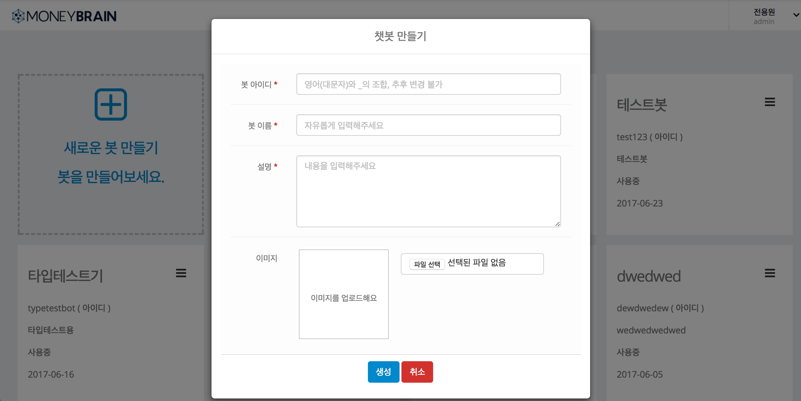

### 챗봇 삭제

삭제하려는 챗봇 카드 우상단의 메뉴버튼을 눌러 챗봇을 삭제할 수 있습니다.

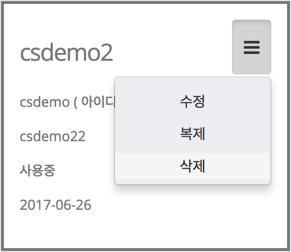

### 챗봇 수정

챗봇의 설정값을 수정할 수 있습니다. (단, 봇 아이디는 수정 불가능)

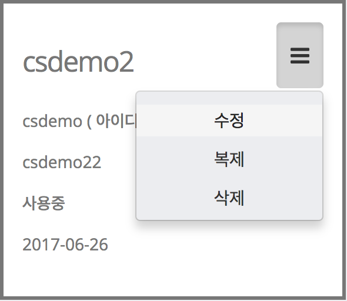

## 챗봇 개발

"챗봇 개발"의 하위 메뉴는 "대화 그래프", "대화학습", "엔터티(Entity)", "인텐트(Intent)", "태스크(Task)" 5가지로 구성되어 있습니다. 이 5가지의 도구를 사용하여, 챗봇을 개발하고 학습시킬 수 있습니다. 챗봇 개발메뉴를 잘 활용할 수록, 더 말을 잘하고 똑똑한 챗봇을 만들 수 있습니다.

### 대화 그래프
--

ATHENA는 대화를 트리 그래프 형식의 UI로 만들어, 사용자가 쉽게 편집하고, 개발할 수 있는 툴을 제공합니다. 그래프는 \*.graph.js 형태의 파일로 저장되고, Task는 \*.js의 파일 형태로 저장됩니다. 그래프를 사용하기 위해서는 "챗봇 개발"의 하위 메뉴인 "대화 그래프"를 클릭하세요.  

#### 대화 단위

네모난 대화상자가 대화단위입니다. 대화 그래프는 대화단위의 조합으로 이루어집니다. 대화단위는 Input, Task, Output으로 구성되어 있습니다.

* Input : 이 대화단위를 트리거 하기 위한 조건 정보를 지정합니다. Input은 키워드, 인텐트, 엔터티, Regexp, 조건문 또는 그것들의 조합으로 이루어집니다.
* Task : api를 통해 데이터를 받는 것 등의 업무를 수행하기 위해 javascript code를 이용할 수 있습니다.
* Output : 봇이 사용자에게 응답하는 정보입니다. Output은 Text, Contents, List, Action 등의 탭으로 이루어져 있습니다.

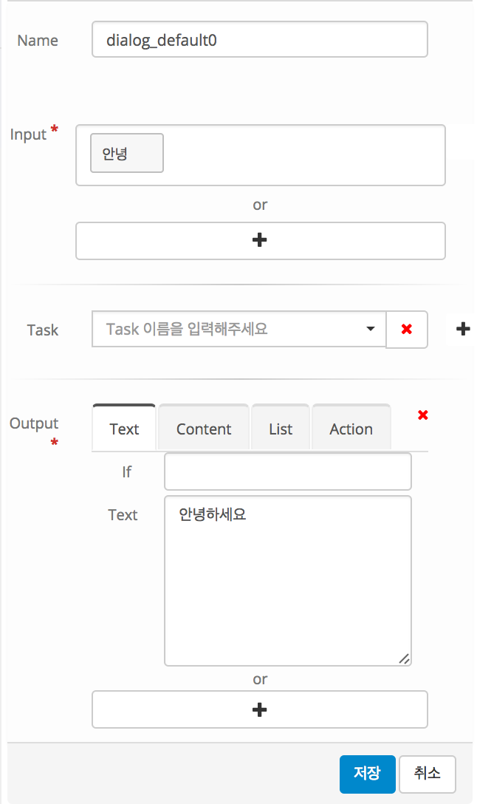

#### 대화 흐름

작성한 대화단위는 위에서 아래로 처리됩니다. 트리를 따라 이동하면서 Input이 충족된 대화단위를 찾으면 해당 대화단위를 트리거합니다. 그 다음 트리거된 대화단위에서 왼쪽에서 오른쪽 방향으로 이동하여 Input 조건을 확인합니다. Child 대화단위를 검사할때는 다시 위에서 아래로 이동합니다.  

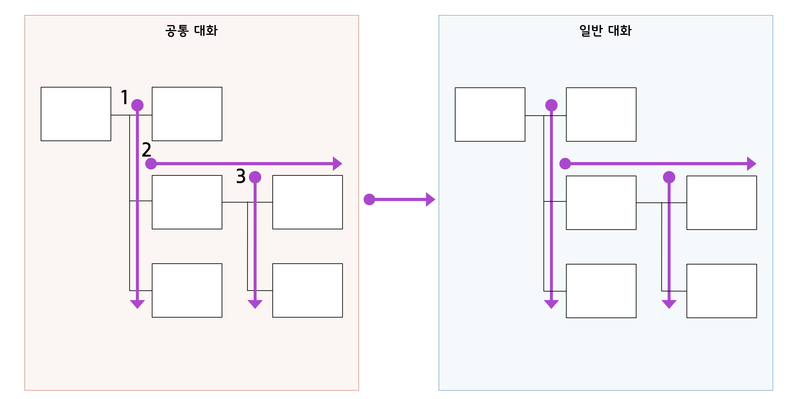

공통 대화단위는 일반 대화단위보다 우선권을 가집니다. 어떤 위치에서 입력되는지 상관없이, 공통 대화단위를 거쳐 일반 대화단위를 검사합니다.


#### 대화단위 생성

그래프에서 대화단위를 추가하기 위해서는 다음 단계를 수행하세요.

1. "챗봇 개발"메뉴의 하위 메뉴인 "대화 그래프"를 클릭하세요. 처음 대화 그래프는 세가지의 대화 단위로 이루어져 있습니다.
	* 시작 : 첫번째 대화단위입니다. 여기에 사용자가 처음 봇과 대화할때 표시되는 인삿말을 설정할 수 있습니다.
	* dialog_default0 : 샘플 대화단위입니다. Input엔 "안녕", Output엔 "안녕하세요"가 설정되어있습니다.
	* 답변없음 (공통) : 최종 대화단위입니다. 트리거된 대화단위가 존재하지 않을 때 사용자에게 표시하는 문장을 설정할 수 있습니다. 기본 값은 "알아듣지 못했습니다." 입니다. "답변없음" 대화단위는 공통 대화단위로서, 수정하기 위해서는 메뉴 탭의 "common" 버튼을 클릭하여야 합니다.
2. 대화단위를 새로 추가하려면 "시작" 대화단위를 선택하고, + 버튼을 클릭하십시오.
3. 대화 수정창이 열리면, Input, Task, Output을 설정하고 저장합니다.
4. 그래프를 수정한 후에는 꼭 전체 저장을 해주셔야 합니다. 우상단 메뉴탭의 저장버튼을 눌러 수정한 사항을 저장해주세요.


#### 대화단위 편집

대화단위는 언제든지 수정/편집이 가능합니다. 대화 단위를 수정하기 위해서는 수정하고 싶은 대화단위를 선택하고, 수정 버튼을 클릭하세요.

##### Name

대화단위의 이름으로써, 이후 Action 등에서 연결할 때에 사용되는 대표값입니다. 대화단위를 기억하기 쉽게 바꿔두면 그래프를 compact모드로 사용하는 상황 등에서 쉽게 원하는 대화단위를 찾을 수 있습니다.

##### Input

Input에는 이 대화단위를 트리거 하기 위한 조건 정보를 지정합니다. Input은 키워드, 인텐트, 엔터티, Regexp, 조건문 또는 그것들의 조합으로 이루어집니다.

* 키워드 : 단순 키워드를 입력할 수 있습니다. 버튼 아래에 자연어 처리된 미리보기를 볼 수 있으며, 사용자가 키워드가 포함된 문장을 입력할 시, 발동됩니다. (키워드 사이에 띄어쓰기를 할 시, AND 조건으로 처리됩니다.) *키워드를 입력하기 위해서는 자연어 형태로 입력 후 엔터 키를 클릭해주세요.*
* 인텐트 : 등록한 인텐트를 입력할 수 있습니다. *인텐트를 입력하기 위해서는 "#"문자를 타이핑 후 리스트에서 선택해주세요.(인텐트가 없을 시에는 리스트가 나오지 않습니다.)*
* 엔터티 : 등록한 엔터티를 입력할 수 있습니다. *엔터티를 입력하기 위해서는 "@"문자를 타이핑 후 리스트에서 선택해주세요.(엔터티가 없을 시에는 리스트가 나오지 않습니다.)*
* 정규식 : 정규식(Regular Expression)을 입력할 수 있습니다. 사용자의 입력값이 정규식에 매치되었을때, 발동됩니다. *정규식을 입력하기 위해서는 ":"를 입력한 후 뒤에 정규식문법을 입력하고 엔터 키를 클릭해주세요.*
* 조건문(If) : 조건문은 Task를 사용하는 등, 복잡한 경우를 다룰 때 사용됩니다. *If를 입력하기 위해서는 If + (띄어쓰기) + 조건 내용 을 입력 후 엔터 키를 클릭해주세요.*

한 Input창에 들어간 것들은 AND 조건으로 처리되며, 새로운 Input창을 추가하였을때는 OR로 처리됩니다.


##### Task

api를 통해 데이터를 받는 것 등의 업무를 수행하기 위해 javascript code를 이용할 수 있습니다. 사용자는 *.js에서 Task를 생성하고 등록한 후, Task를 대화단위에 연결시킬 수 있습니다. 대화 수정창에서 Task 리스트 버튼을 클릭하면 등록한 Task를 선택하여 연결할 수 있습니다.

##### Output

봇이 사용자에게 응답하는 정보입니다. Output은 Text, ContentInput, List, Action 등의 탭으로 이루어져 있습니다. 이 탭들 중 하나를 선택하여, Output의 형태를 지정할 수 있습니다.

* Text : 조건문 입력창과 텍스트 입력창으로 나누어져 있습니다. 봇의 대답을 간단한 텍스트 답변의 형태로 설정할때 사용합니다.
* Content : 조건문, 이미지, 텍스트, 버튼을 등록하는 입력창들로 이루어져 있습니다. 이미지와 텍스트는 단독으로 혹은 조합하는 두 가지 경우 모두 사용될 수 있고, 버튼은 텍스트가 있을 때에만 사용 가능합니다. (이미지 - Content 조합별 Output 예시)
* List : 리스트형태로 Output을 설정할때 사용합니다. 리스트 탭에서 Output을 작성하였을 시, 페이스북은 카드형태로 보여지며, 카카오톡은 텍스트 형태로 리스트가 나오고 선택 대화단위가 추가됩니다. (이미지 - 페이스북, 카카오톡 예시)
* Action : 사용자에게 답변을 보여주는 대신 각종 Action을 설정할 수 있습니다.
	* Call : 다른 대화단위를 호출하여 재사용할 수 있습니다. 호출 할때는 대화단위 이름으로 호출합니다. Call로 호출된 대화단위는 설정된 Input과 상관없이 발동됩니다. Option에 텍스트를 입력하면, 호출된 대화단위의 Output 대신 Option의 텍스트가 출력됩니다.
	* CallChild : 사용자의 입력을 다른 대화단위의 하위 대화단위에서 검색합니다. 호출 할때는 대화단위 이름으로 호출합니다. CallChild로 호출된 대화단위의 하위 대화단위중 받아온 사용자의 입력이 input 조건에 성립하는 게 존재하면 그 하위단위가 발동됩니다. Option에 텍스트를 입력하면, 발동된 하위 대화단위의 Output 대신 Option의 텍스트가 출력됩니다.
	* ReturnCall : 다른 대화단위를 호출하여 재사용한 후, 다시 돌아옵니다. 호출 할때는 대화단위 이름으로 호출합니다. ReturnCall로 호출된 대화단위는 설정된 Input과 상관없이 발동됩니다. 호출된 대화단위에서부터 대화를 진행하다가 Return Action을 가진 대화단위에서 원래 대화단위로 돌아옵니다. Option에 텍스트를 입력하면, 호출된 대화단위의 Output 대신 Option의 텍스트가 출력됩니다.
	* Return : ReturnCall과 같이 사용됩니다. ReturnCall의 설명 참조.
	* Up : 이전에 발동된 대화단위로 이동합니다.(따로 대화단위를 선택하지 않습니다.) 호출된 대화단위는 설정된 Input과 상관없이 발동됩니다. Option에 텍스트를 입력하면, 호출된 대화단위의 Output 대신 Option의 텍스트가 출력됩니다.
	* Repeat : 상위 대화단위로 이동합니다.(따로 대화단위를 선택하지 않습니다.) 호출된 대화단위는 설정된 Input과 상관없이 발동됩니다. Option에 텍스트를 입력하면, 호출된 대화단위의 Output 대신 Option의 텍스트가 출력됩니다.

한 Output창에 들어간 것들은 AND 조건으로 처리되며, 새로운 Output창을 추가하였을때는 OR로 처리됩니다.(Output들 중 랜덤 선택) (이미지)

단, If 조건을 사용하여 Output을 여러개 작성하였을 경우, 자동으로 분기되며, 분기별로 하위 대화단위를 추가할 수 있습니다.

#### 대화 그래프 단축키 (Shortcuts)

* 대화 그래프
	- ← ↓ ↑ → : Navigate Dialog  
	- Ctrl + ↑ → : Move Dialog Up/Down  
	- Enter : Open Edit Dialog  
	- Esc : Cancel Edit  
	- Insert : Add child dialog  
	- Del : Delete Dialog  
	- Space : Expand/Collapse Child Dialog  

* 대화 수정창
	- Tab : Next (Input, Task, Output 전환, Input 등 여러 개 인경우 한줄씩 이동)  
	- Ctrl+Enter : Save Dialog Modal  

* js Code Editor
	- Alt+← : Back (Dialog Graph에서 Code Editor로 온 후에 복귀)  

* 사이드바
	- Ctrl+P : Open/Close Project Files  
	- ← ↓ ↑ → : Navigate Tree  
	- Enter : Open File  

* 공통
	- / : Search Box  
	- Ctrl+S : Save File  
	- Ctrl+Z : Undo  
	- ? : keyboard shortcut help  

### 대화학습
--

봇은 그래프와 대화학습 두가지 방법으로 구성될 수 있고, 함께 사용하는 것도 가능합니다. 대화학습은 대화셋을 통해 챗봇을 학습시키는 기능입니다. 대화셋(DialogSet)은 딥러닝을 통한 챗봇 개발을 할 수 있게 하는 도구입니다. 대화셋은 '질문:답변 = 1:1' 방식으로 작성되어야 하며, 사용자의 입력 문장과 가장 유사도가 높은 질문을 찾아 답변을 출력하는 Retreival방식의 모델을 사용합니다. 그래프와 대화셋을 같이 사용하였을 경우에는, 그래프가 답변에서 우선순위를 가집니다.  

대화셋은 기본대화셋과 추가대화셋으로 나뉘어져있고, 기본대화셋은 작성 즉시 적용되며, 추가 대화셋은 추가적으로 연결/해제가 가능합니다.


#### 기본 대화셋 작성
기본 대화셋을 작성하기 위해서는 사이드바의 대화학습 메뉴를 클릭하세요. 기본 대화셋은 OneByOne(1:1)로 작성할 수 있게 되어있습니다. 질문과 그에 대한 답변을 입력하고, 질문의 카테고리를 입력해주세요. 카테고리는 딥러닝을 보조해주는 기능으로서, 대화학습에서 문맥파악이 가능하게 합니다. 사용자의 입력이 특정한 카테고리 내의 질문과 매치되면, 이후 사용자가 추가적인 입력을 했을 때, 카테고리 내의 질문들에 우선순위를 부여합니다.

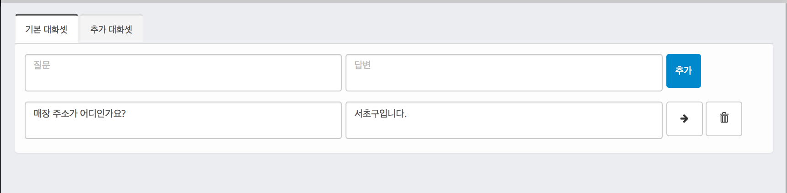

#### 추가 대화셋 작성 및 연결
추가 대화셋을 작성하기 위해서는 기본 대화셋 오른쪽 "추가 대화셋"탭을 클릭하세요. 여기서 "신규등록" 버튼을 클릭하여 추가등록셋을 작성합니다.

##### 개별 대화로 만들기
기본 대화셋에서와 같이 OneByOne으로 대화를 작성할 수 있습니다. 작성 후에는 "대화셋으로 저장"버튼을 클릭하여 작성을 완료해주세요.

* Title : 대화셋 제목을 입력해주세요. 이후 이 값을 대표값으로 사용합니다.
* Content : 대화셋에 대해 설명해주세요.
* 개별 대화 입력 : "기본 대화셋 작성" 참조

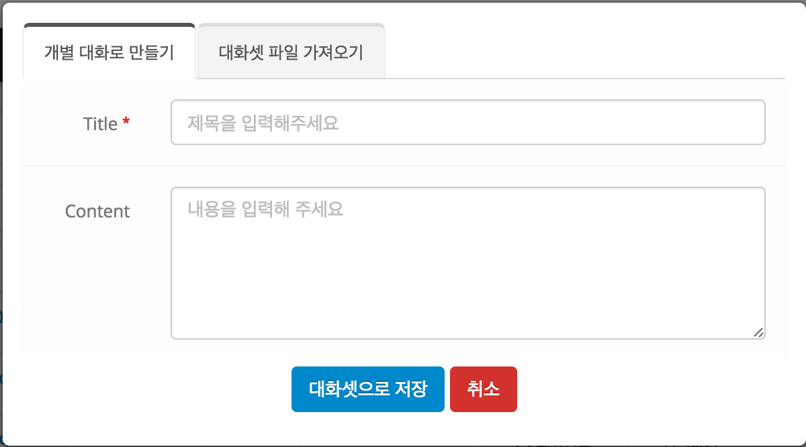

##### 대화셋 파일 가져오기
엑셀파일(xlsx), csv파일, 카카오톡백업파일(csv or txt), 자막파일(smi) 등을 가져오기(import)할 수 있습니다. 엑셀파일에서 header 행(첫번째 행)에 question을 넣은 열을 질문, answer를 넣은 열을 답변으로 인식합니다. question과 answer 열 앞에 category 열 또한 추가하여 인식할 수 있습니다. import를 위한 형식은 아래에서 받을 수 있습니다. (링크) 작성 후에는 "생성"버튼을 클릭하여 작성을 완료해주세요.

* Title : 대화셋 제목을 입력해주세요. 이후 이 값을 대표값으로 사용합니다.
* Type : 업로드할 파일의 유형을 선택해주세요. 현재 엑셀파일(xlsx), csv파일, 카카오톡백업파일(csv or txt), 자막파일(smi)을 지원합니다.
* File : 가져오기 할 파일을 업로드해주세요. Type에서 선택한 형식의 파일을 업로드해주세요.
* Content : 대화셋에 대해 설명해주세요.

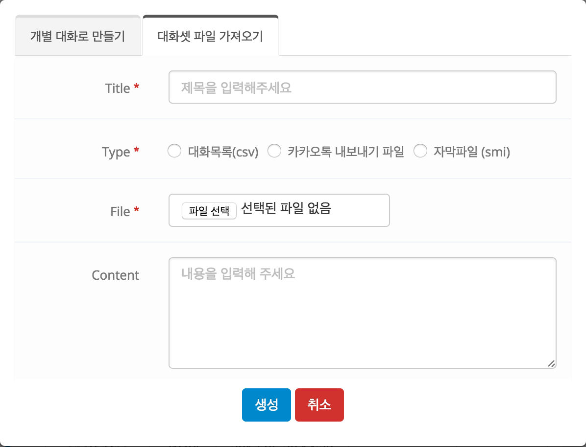

##### 추가 대화셋 연결

추가 대화셋을 등록하면 탭에 리스트형태로 표시되고 연결할 수 있습니다. 추가 대화셋을 연결하기 위해서는 연결하고자 하는 대화셋 오른쪽 "연결하기"버튼을 클릭하세요. 이후 연결을 끊고 싶으면 다시 버튼을 누르면 연결이 끊어집니다.

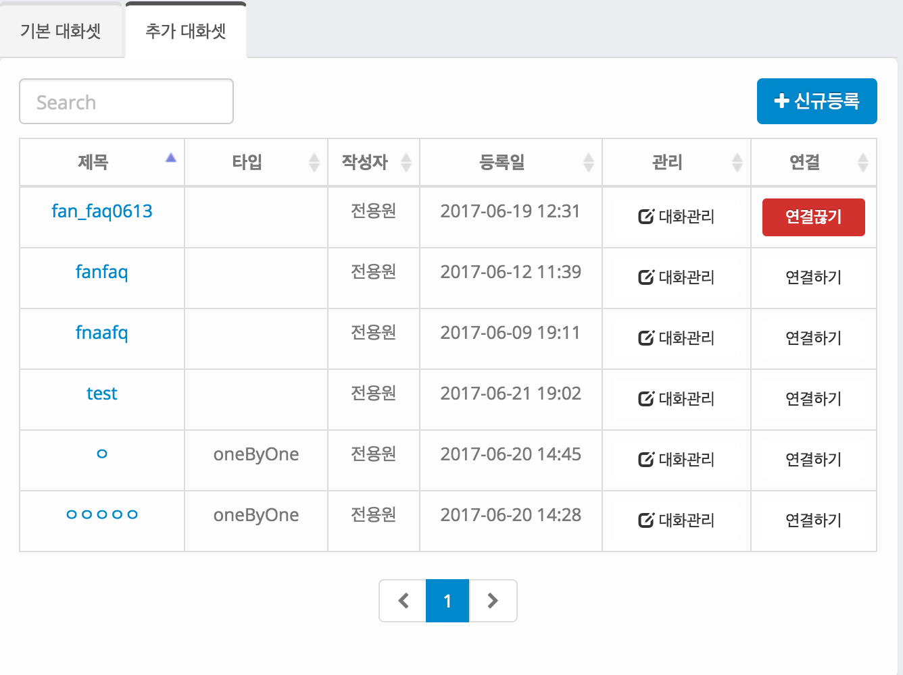

##### 추가 대화셋 대화관리

추가 대화셋에 새로운 데이터를 추가하거나 삭제할 수 있습니다. 추가 대화셋의 대화를 관리하기 위해서는 대화셋 오른쪽 "대화관리"버튼을 클릭하세요. 추가 대화셋을 "개별 대화로 만들기"로 만들었든지, "대화셋 파일 가져오기"로 만들었든지에 관계없이 OneByOne(1:1)방식으로 대화를 수정, 생성, 삭제 할 수 있습니다.

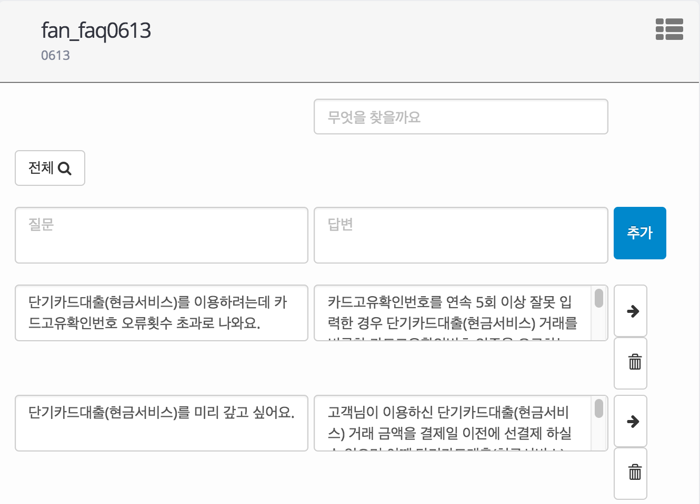

### 엔터티(Entity)
--

ATHENA에는 머니브레인의 자체 NLU모듈이 탑재되어있습니다. 사용자가 입력한 문장은 NLU모듈을 통해 분석되고, 결과값으로 엔터티와 인텐트를 받아옵니다. 개발자는 엔터티를 Dialog의 Input으로 설정하여 대화를 발생시킬수 있습니다. 또한 엔터티를 Parameter로 사용하여, Task를 개발할 수 있습니다. 특정 봇에서 정의된 엔터티는 봇의 기능에 따라 달라집니다. 즉, 모든 개념에 대하여 엔터티를 설정할 필요는 없습니다.

예를들어 날씨를 가르쳐주는 봇이 있다고 가정합니다. 이 봇에게 `날씨 알려줘`라고 질문할 수 있습니다. 이것은 단순히 인텐트만 사용한 것입니다. 하지만 여기서 추가적으로 `오늘 날씨 알려줘`, `서울 날씨 알려줘`, `오늘 서울 날씨 알려줘` 등과 같이 질문할 수 있습니다. 여기서 `오늘`, `서울` 같은 변수들을 엔터티라고 합니다. 예를들어 여기서 `오늘`은 "날짜" 엔터티, `서울`은 "장소" 엔터티에 들어가있습니다. 이런 엔터티 값을 받아 Task에서 엔터티를 parameter로 사용하여 날씨를 조회할 수 있습니다.

#### 엔터티 생성

엔터티를 생성하기 위해서는 아래 단계를 수행하세요.

1. "챗봇 개발"의 하위 메뉴인 "엔터티(Entity)"메뉴를 클릭하세요. 
2. "신규 등록" 버튼을 클릭하세요
3. 엔터티를 작성하세요.
	* 이름 : 엔터티 이름을 작성해세요. 추후 연결을 할 때 이 값을 대표명으로 사용합니다. 개념적으로 이름은 엔터티 내용들을 포괄합니다. (예: 장소)
	* 내용 추가 : 여기에 엔터티의 내용을 추가하세요. (예: 서울, 대구, 부산)
	* 동의어 : 엔터티에 속한 각 내용에 대해 동의어를 추가할 수 있습니다. 동의어로 인식 된 경우 내용을 대표값으로 받아옵니다. (예: 서울 - Seoul)
4. "생성"버튼을 클릭하여 저장하세요.

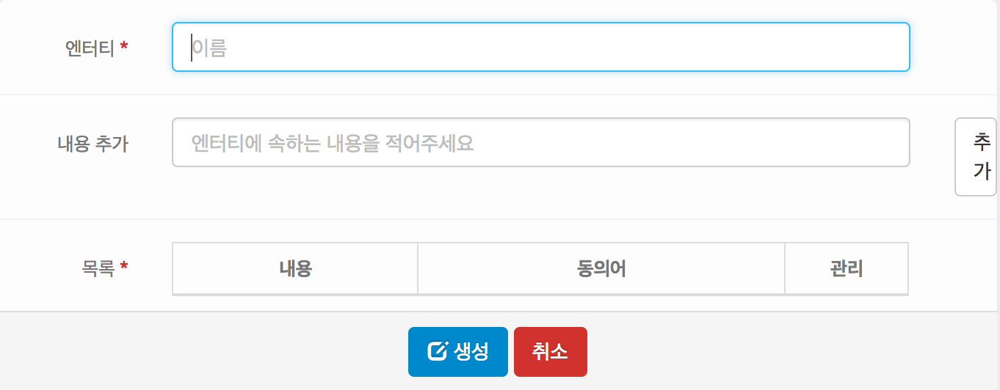

#### 엔터티 연결

엔터티는 대화 그래프의 Input, 그리고 Task 두 가지 경우에 사용됩니다.

대화그래프의 Input에서 엔터티를 쓰기 위해선 Input창에 @을 타이핑 후, 리스트 중에 원하는 Entity를 선택하면 됩니다. (그래프 참조)

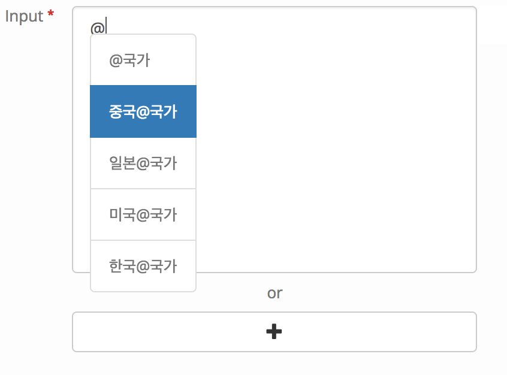

Task에서 엔터티를 parameter로 사용할 수 있습니다. paramDef 속성에 Task에서 사용되는 엔터티를 값으로 입력하세요. (Task 참조)

### 인텐트(Intent)
--

사용자가 입력한 문장은 자연어 처리 모듈을 통해 분석되고, 결과값으로 엔터티와 인텐트를 받아옵니다. 인텐트는 입력한 문장들을 토대로 의도를 분석하는 도구로서 개발자는 인텐트를 Dialog의 Input으로 설정하여 대화를 발생시킬수 있습니다. 챗봇에서 어떤 내용을 처리할 것이고, 어떤 구조로 이루어지는지를 고려하여 인텐트를 구성하여햐합니다.

#### 인텐트 생성

인텐트 생성하기 위해서는 아래 단계를 수행하세요.

1. "챗봇 개발"의 하위 메뉴인 "인텐트(Intent)"메뉴를 클릭하세요. 
2. "신규 등록" 버튼을 클릭하세요
3. 인텐트를 작성하세요.
	* 이름 : 인텐트 이름을 작성해세요. 추후 연결을 할 때 이 값을 대표명으로 사용합니다. 개념적으로 이름은 인텐트 내용들을 포괄합니다. (예: 예약)
	* 내용 추가 : 여기에 인텐트의 내용을 추가하세요. 인텐트의 목적에 부합하는 예문들을 다양하게 작성하세요. (예: 예약하고 싶어, 예약해줘, 예약 가능할까?)
4. "생성"버튼을 클릭하여 저장하세요.

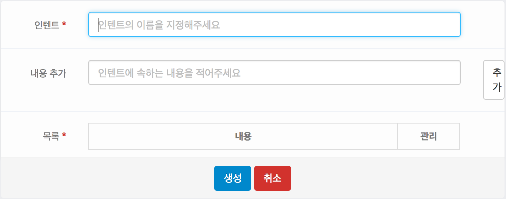

#### 인텐트 연결

인텐트는 대화 그래프의 Input에 사용됩니다.

대화그래프의 Input에서 인텐트를 쓰기 위해선 Input창에 #을 타이핑 후, 리스트 중에 원하는 인텐트를 선택하면 됩니다. (그래프 참조)

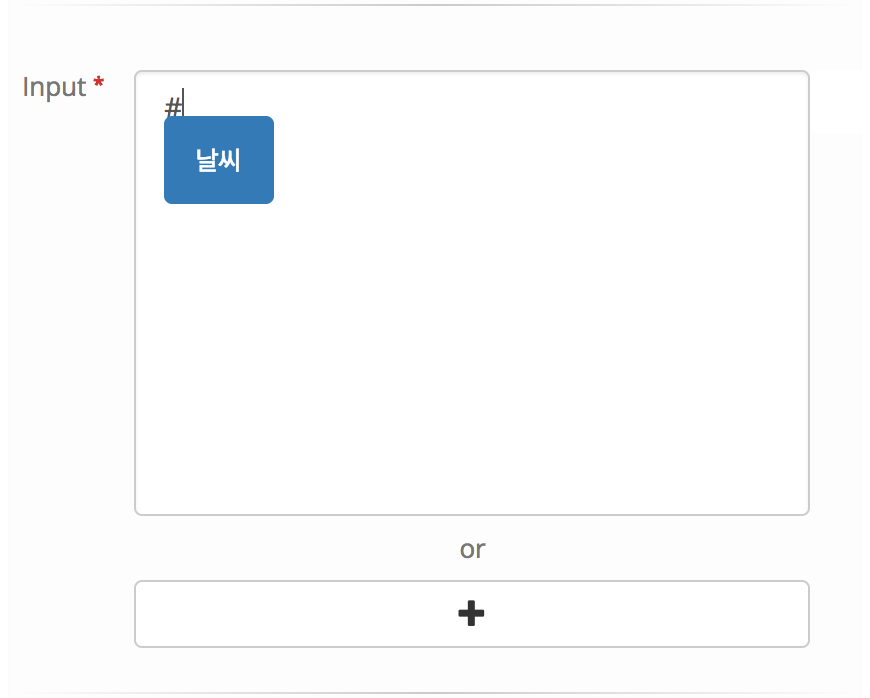

### 태스크(Task)
--

ATHENA의 봇은 사용자의 질문에 대한 정해진 답변만을 출력하는 것에 머물지 않습니다. 사용자의 질문, 요청 등 입력에 대해 태스크(업무)를 수행하고, 이를 답변으로 출력하는 것을 목표로 합니다.  
이때 사용자의 요청에 대한 수행할 업무를 정의한 것을 태스크 라고 합니다. 태스크의 구현은 Javascript 언어(Node.js기반)로 구현하며, Task를 비롯한 자료들은 JSON 형태로 정의합니다.  
Task는 *.js파일에서 정의되며, 대화 그래프 편집창 왼쪽 파일트리 혹은 위쪽 탭에서 들어갈 수 있습니다.  

#### 태스크 형식
Task의 기본적인 포맷은 다음과 같이 정의됩니다.  

```javascript
var bot = require(path.resolve('config/lib/bot')).getBot('defaultbot');

var defaultTask = {
    name: 'defaultTask',
    action: function(task, context, callback) {
        callback(task, context);
    }
};
bot.setTask("defaultTask", defaultTask);
```
#### Action
Action 함수는 Task 내에서 실제 구현이 들어가 있는 함수로 다음과 같이 정의한다.  

```javascript
function actionName(task, context, callback) {	
	// 여기에 Task에 처리할 내용을 구현한다. 
	callback(task, context);			
}
```

Action 함수는 세가지 파라메터 변수를 받으며, 그 정의는 다음과 같습니다.  
첫번째, 파라미터 변수인 task는 action 함수에서 업무 처리에 필요한 정보를 JSON 형태로 받고, 처리한 결과를 담아서 return 하는 데 사용됩니다. 내부적으로는 action이 정의된 task와 같은 JSON 객체이다.  
두번째, 파라미터 변수인 context는 문맥, 상황을 위한 변수입니다. 스마트한 봇을 구현하기 위해 대화의 문맥, 사용자의 정보 들을 context에 담아서 JSON 형태로 전달합니다.  
세번째, 파라미터 변수인 callback은 결과를 return 하는 역할을 합니다. Action 함수는 비동기(Async) 방식으로 구현합니다. 그러므로 업무 처리가 끝나면 반드시 callback을 호출하여야 합니다.  
Action 함수를 세가지 파라미터 변수로 표준화 함으로써 어떠한 업무를 처리하는 Action 함수도 동일한 구조로 구현할 수 있게 합니다. 다양한 업무처리에 필요한 변수가 달라질 수도 있는 점은 task와 context 변수를 JSON 으로 정의해서 필요한 정보를 JSON에 담아서 보내는 방식으로 처리합니다.

##### Task Parameter
자세한 설명 전에 간단한 Action 함수를 예제로 정의해 봅니다. 아래 함수는 http 요청을 해서 웹에서 데이터를 가지고 옵니다. task는 node 기반 javascript로 작성할 수 있어 node library를 사용할 수 있다. 에러 예외 처리 등은 되어 있지 않는 예시용 함수입니다. 

```javascript
function httpAction(task, context, callback) {
	var request = require('request');
	request({url: task.url}, function (error, response, body) {
	  if (!error && response.statusCode == 200) {
		task.content = body;
	    callback(task, context);
	  }
	})
}
```
위에서 request 모듈은 node에서 많이 쓰이는 http request 라이브러리로 자세한 내용은 https://github.com/request/request 를 참고합니다. 

다음으로 Task 파라미터 변수를 설정하는 방법을 알아봅니다.  
Task를 정의할 때 추가하는 방법입니다. 미리 정의된 변수라고 생각할 수 있습니다.

```javascript
var googleTask = {
	url: 'https://www.google.com',
	action: httpAction,
}
```

위와 같이 정의한 googleTask를 실행하면, task.uri 에 있는 google 주소에 접속에 페이지의 HTML을 읽어서 task.content에 저장합니다.

```javascript
var naverTask = {
	url: 'http://www.naver.com',
	action: httpAction,
}
```
위와 같이 정의한 naverTask를 실행하면, task.uri 에 있는 naver 주소에 접속에 페이지의 HTML을 읽어서 task.content에 저장합니다.

##### Context Parameter

context는 해당 task에 제한되지 않은 여러정보들을 담고 있습니다. 이를 통해 현재 사용자의 입력에 해당되는 정보뿐만 아니라, 사용자 정보 등 다양한 상황에 따른 처리를 할 수 있습니다.  
현재 정의된 상황별 context는 다음과 같습니다.

* context.user: 사용자의 정보를 담고 있다. 
* context.bot: 현재 봇의 정보를 담고 있다. 
* context.botUser: 현재 봇을 사용하는 사용자의 정보를 담고 있다. 
* context.dialog: Dialog가 여러단계로 이루어지는 경우 대화의 문맥을 파악하기 위해 사용 한다. 
	
머니브레인 봇의 모든 데이터는 JSON을 기반으로 하므로, bot 개발시 필요한 경우 각 context 수준에 맞게 추가적인 key를 정의하여 사용할 수 있습니다. 

#### Task 결과 후처리
Action 함수에서 처리한 결과를 xpaht 와 regexp로 간편하게 추출하여 사용할 수 있습니다. 또는, 결과값을 http 등으로 받는 html 데이터를 xpath 를 사용하여 저장할 수 있습니다.  
아래의 예시와 같이 하면 html 값에서 <title></title> 사이의 값을 xapth로 읽어서 task.title 에 저장합니다. _text: 'body' 로설정한 것은 task.body 에 있는 값을 사용해서 xpath 검색을 한다는 의미로 http 요청으로 받은 데이터가 task.body 에 저장되어 있기 때문입니다.  

```javascript
var xpathTask = {
	url: 'https://www.google.co.kr/search?q=moneybrain.ai',
	action: httpAction,
	xpath: {
	    _text: 'body',
		title: '//title/text()'
	}
}
```
아래와 같이 하면 html 값에서 검색리스트를 task.doc 에 array 형태로 저장합니다. doc 하부에 _repeat에 있는 xpath로 목록을 가져와서 list와 link 값으로 array를 구성합니다. doc 과 다른 이름으로 추가 xpath를 지정하여 여러게의 list 을 담을 수 있습니다.  

```javascript
var xpathListTask = {
	url: 'https://www.google.co.kr/search?q=moneybrain.ai',
	action: httpAction,
	xpath: {
	    _text: 'body'
		title: '//title/text()',
        doc: {
	      _repeat: '//div[@class="srg"]/div[@class="g"]',
          list: '//a/text()',
          link: '//a/@href',
        }			
	}
}
```
정규식(Regular Expression)을 이용하여 결과값을 task 에 저장할 수 있습니다. 아래 예시에서는 정규식을 사용하여 html에서 title 값을 task.title에 저장합니다.  

```javascript
var xpathTask = {
	url: 'https://www.google.com',
	action: httpAction,
	regexp: {
	    _text: 'body',
		title: /<title>(.*)<\/title>/
	}
}
```
아래와 같이 하면 검색 리스트 텍스트에서 regexp로 match하여 task.doc을 array 형태로 저장합니다. _repeat에 있는 정규식 g flag 로 검색하여 여러개의 매치를 찾고, ( ) 를 사용하여 변수에 저장합니다. link와 list의 숫자는 매치 저장에서 저장되는 순서이며 1번부터 시작합니다.  

```javascript
var xpathTask = {
	url: 'https://www.google.com',
	action: httpAction,
	regexp: {
	    _text: 'body',
		title: /<title>(.*)<\/title>/
		doc: {
			_repeat: /<h class="r"><a.*href="(.*)".*>(.*)<\/a></h>/g
			link: 1,
			list: 2
		}
	}
}
```
#### PreCallback,  PostCallback

아래와 같이 task에 preCallback, postCallback 함수를 구현하여 action 함수를 호출하기 전, 후에 처리할 작업을 추가할 수 있습니다.  

```javascript
var sampleTask =
{
  name: 'sample',
  preCallback: function(task, context, callback) {
      // 여기서 Action 함수를 호출하기 전에 수행할 일을 구현
	  callback(task, context);
  },
  action: sampleAction,
  postCallback: function(task, context, callback) {
      // 여기서 Action 함수를 호출한 후에 수행할 일을 구현
	  callback(task, context);
  }
};
```

#### Action Parameter Definition

Action 함수에서 사용할 Entity 정보를 paramDefs로 정의할 수 있습니다. Action 함수의 Entity 정보를 정의하는 이유는 Dialog를 통해서 Task 를 사용할 때 어떠한 정보를 넘겨주어야 하는지 파악할 수 있기 때문입니다. 필수적인 정보가 입력된 내용에 없을 경우는 봇이 자동으로 사용자에게 질문하여 정보를 얻을 수 있습니다.  

```javascript
var sampleTask =
{
  name: 'sample',
  paramDefs: [
    {name: '휴대폰', type: mobileType, require: false, dialog: '휴대폰Dialog'},
  ],
  action: sampleAction,
};
```

paramDef 정의에는 다음의 속성들이 사용가능합니다.  

* name: 정의할 엔터티 이름으로 task JSON 개체에 같은 이름으로 저장된다. 
* require: boolean 형으로 필수 Entity 여부. 필수 Entity가 task에 없는 경우 봇이 사용자에게 요청하는 질문을 하여 입력을 받는다. 
* question: String 형으로 봇이 사용자에게 Entity를 물어볼 경우 질문 내용
* dialog: 봇이 사용자에게 Entity를 물어볼 경우 단순한 질문이 아니라, 몇단계의 dialog 가 있을 수 있는데 이를 정의한다. String 값이면 같은 이름의 dialog를 찾고, dialog 개체를 바로 참조할 수도 있다. 

#### Task 구조화

Task를 한가지 이상 조합하여 상위 Task를 만들 수 있습니다.  

여러개의 Task를 연결하여 실행할 수 있습니다. 아래의 예시에서는 sequenceTask는 sampleTask1을 실행하고, sampleTask2를 실행합니다. 

```javascript
var sampleTask1 =
{
  name: 'sample1',
  action: function (task, context, callback) {
    task.result = 'sample1';
    callback(task, context);
  }
};

var sampleTask2 =
{
  name: 'sample2',
  action: function (task, context, callback) {
    task.result = 'sample2';
    callback(task, context);
  }
};

var sequenceTask = {
	action: 'sequence'
	tasks: [
		sampleTask1,
		sampleTask2,
	]
}
```

while이나 for 문처럼 특정조건이 true일때 까지 반복해서 Task을 수행하게 할 수 있습니다. 조건이 true인지를 체크하는 방법은 수식이나 boolean을 return 하는 함수로 할 수 있습니다. 아래 예에서는 10번까지 Task를 반복 수행합니다.  

```
var sequenceTask = {
	action: 'while'
	whileIf: function(task, context) {
		if(!task.count) task.count = 0;
		else task.count++;
		
	    return task.count <= 10;
    }, 
	actions: [
		sampleTask1,
		sampleTask2
	]
}
```

if 문처럼 특정 조건일때만 Task를 실행하게 할 수 있습니다. 조건이 true인지를 판단하는 것은 조건식이나 function 으로 정의가 가능합니다. 아래 예시에서는 sequence로 여러 task를 실행할 때 각 task if 조건이 맞는 경우에만 실행됩니다.  

```
var sequenceTask = {
	action: 'sequence'
	tasks: [
		{
		  name: 'sample1',
		  if: function(task, context) {
		    return task.mobile != undefined;
		  },
		  action: function (task, context, callback) {
		    task.result = 'sample1';
		    callback(task, context);
		  }
		},
		{
		  name: 'sample2',
		  if: 'context.user.mobile == undefined',
		  action: function (task, context, callback) {
		    task.result = 'sample2';
		    callback(task, context);
		  }
		}
	]
}
```

이러한 task 구조 상에서 다른 상하 task를 참조할 수 있습니다.  

* task.topTask:  최상위 Task
* task.parentTask: 상위 Task
* task.preTask: 이전 Task

#### Task 간 데이터 전달

Task의 연결관계, 상하구조에서 데이터를 전달하기 위해서 기본적으로 preCallback, postCallback을 사용할 수 있습니다.  

아래 예시에서는 preCallback을 통해 sequence 등의 이전 task에서 query 값을 가져와서 task.param으로 사용합니다. postCallback을 통해서는 task에서 처리한 result.query 값을 topTask에 저장해 놓습니다. 

```javascript
var sampleTask =
{
  name: 'sample',
  preCallback: function(task, context, callback) {
	  task.param.query = task.preTask.result.query;
	  callback(task, context);
  },
  action: sampleAction,
  postCallback: function(task, context, callback) {
	  task.topTask.param.query = task.result.query;
	  callback(task, context);
  }
};
```
아래와 같이 task 속성을 통해 데이터를 전달할 수도 있습니다.  

```javscript
var sampleTask = {
  name: 'sample',
  data: {
	set: 'replace',
	context: {
	  user: ['result.doc']
	}, 
	task: {
	  topTask: ['result.title'], 
	  parent: ['param.title']
	}
  },
  action: sampleAction
};

var sampleTask = {
  name: 'sample',
  data: {
	get: 'merge',		
    context: ['bot.botName', 'user.mobile'], 
    task: ['topTask.name', parent.result.doc']
  },
  action: sampleAction
};
```

data 속성 안내는 두가지 key 값으로 구분을 합니다.   

* get: context 나 다른 task에서 값을 가져와 현재 task에 저장한다. 
* set: 현재 task의 결과를 context 나 다른 task에 저장한다. 

데이터를 전달하는데 다음의 옵션들이 있습니다.  

* replace: 기본 옵션으로 같은 key의 데이터가 있으면 대체한다.
* merge: 같은 key의 기존 데이터가 있으면 다른 부분만 새로 겹쳐서 합친다.
* concat: 데이터가 array인 경우 두 array를 합쳐서 저장한다. array concat 함수와 동일

#### Template Task 

Template task를 사용해서 기존에 있던 task를 재사용하여 확장할 수 있습니다. task의 template 항목에 상속받을 template task 참조를 넣습니다. 참조의 방법은 일반 task참조와 동일합니다.

아래의 예시에서는 googleTask의 url은 그대로 사용하고, moneybrainTask에서 task.param.q 만 변경하여 요청합니다.

```javascript
var moneybrainTask = {
  name: 'moneybrainTask',
  template: googleTask,
  param: {
	  q: 'moneybrain.ai'
  }
};

var googleTask = {
	url: 'https://www.google.com',
	param: {
		q: ''
	},
	action: httpAction,
}
```

#### 공개 태스크 등록
만든 태스크를 다른 사람들에게 공유할 수 있습니다. 태스크를 공개 등록하기 위해서는 "챗봇 개발"의 하위 메뉴인 "태스크(Task)"를 클릭하세요. 공개하고 싶은 태스크의 오른쪽에 공개 등록을 클릭하여 태스크를 공개할 수 있습니다.

(이미지)

#### 공개 태스크 사용
다른 사람이 만든 태스크를 사용하기 위해서는, 대화 그래프 수정창 태스크 선택창에서 검색하여 선택하여 사용합니다.

(이미지)

## 챗봇 테스트
개발한 챗봇을 ATHENA 페이지에서 실시간으로 테스트할 수 있습니다. 테스트를 하여 구상했던 챗봇의 대답과 일치하는지 확인하고 수정/반영하세요. 챗봇 테스트는 실제 대화를 해보며, 그리고 분석페이지를 같이 확인하며 진행할 수 있습니다.

### 대화창
오른쪽 사이드에 대화창이 준비되어있습니다. 대화창에서 챗봇과 실제로 대화하며 원하는 답변이 나오는 지 확인 할 수 있습니다. 대화 그래프 메뉴를 열어놓고 대화를 진행하면, 현재 활성화되어있는 대화단위가 하이라이트 표시됩니다.

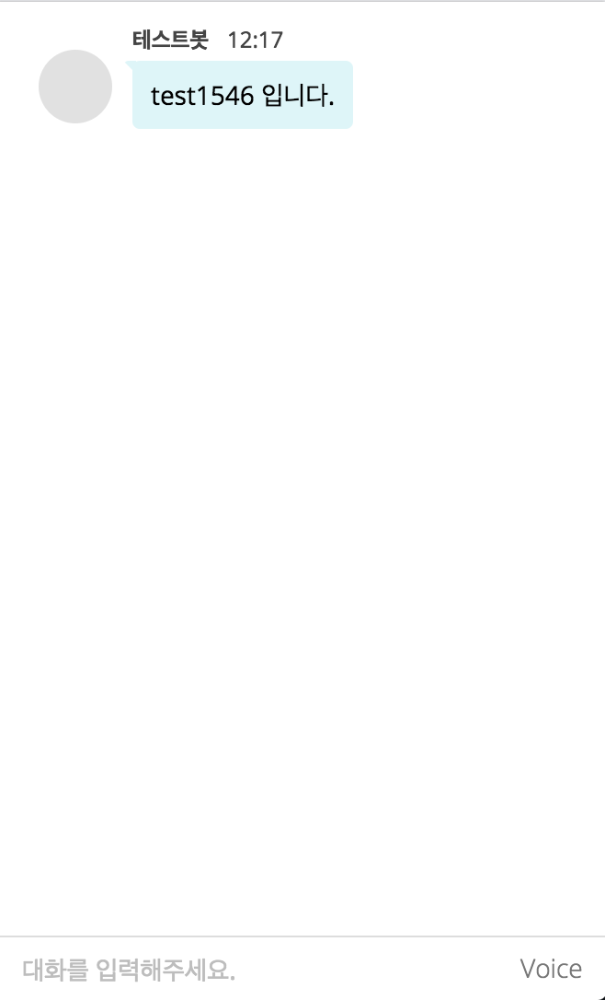

### 대화 분석
하단 분석창의 탭을 클릭하여, 현재 대화진행 상황을 구체적으로 분석한 결과를 확인할 수 있습니다.

#### 대화학습 분석
대화학습 분석 탭에서는 사용자가 입력한 대화와 대화셋을 비교분석하여 보여줍니다. 대화학습 분석을 통해 대화셋에서 답변이 나오는 과정을 이해하고, 수정 및 보완할 수 있습니다.

* Category : 카테고리가 있는 대화를 진행하였으면 카테고리가 설정됩니다. 이후 대화에서 카테고리가 있는 대화를 우선순위로 설정합니다.
* NLU : 사용자의 입력이 자연어처리 된 결과를 보여줍니다. (사용자의 입력과 대화셋의 질문을 각각 자연어처리하여 유사도를 측정합니다.)
* Best Sentence : 가장 유사도가 높은 질문을 보여줍니다.
* Sentences Inputs : 유사도가 높은 순으로 질문들을 정렬하여 보여줍니다.

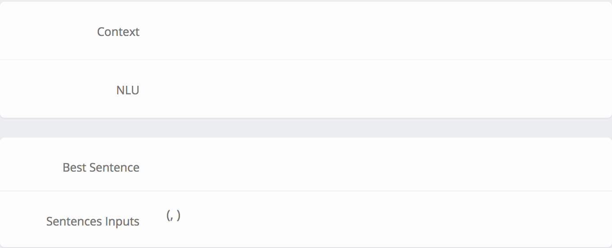

#### 대화요소 분석
대화요소 분석 탭에서는 현재 진행되는 대화에서 인식되고 사용되는 요소들(Context, Intent, Entity, Task, Parameter)을 추출하여 보여줍니다. 

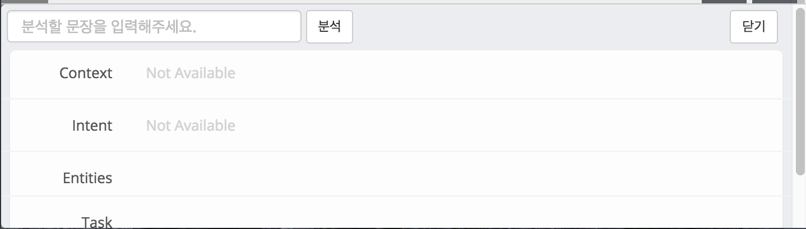

#### Log
개발자를 위한 탭으로서, Console log를 보여줍니다. Task 등을 개발했을 시에, log를 통해 디버깅을 할 수 있습니다.

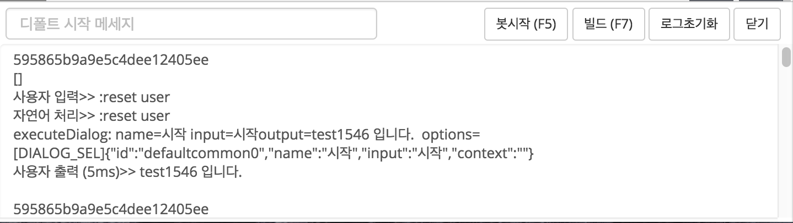

## 컨텐츠 관리

## 배포
현재 ATHENA는 카카오톡, 페이스북, 라인 세 가지의 채널을 지원합니다. 사용자는 원하는 채널들에 개발한 챗봇을 연결하여 직접 서비스 할 수 있습니다.

### 카카오톡에 배포하기
카카오톡에 챗봇을 배포하기 위해서는 다음 단계를 수행하세요.

1. 카카오 옐로아이디를 만듭니다.(https://yellowid.kakao.com/login)
2. 옐로아이디 프로필을 만들고 심사를 기다립니다.(5일 이내 소요)
3. 심사된 프로필로 옐로아이디 페이지 자동응답 탭으로 들어갑니다.
4. API 자동응답 설정하기로 들어갑니다.
5. 앱 이름, URL, 설명, 전화번호를 설정합니다.

자세한 설명 및 앱 URL은 "배포"메뉴의 카카오톡 로고 아래의 "메신져봇 생성" 버튼을 클릭하면 확인할 수 있습니다.

### 페이스북에 배포하기
페이스북에 챗봇을 배포하는 것은 간단합니다. ATHENA에서는 페이스북 자동 연결을 제공하고 있기 때문에, 페이스북 로고 아래의 "메신져봇 생성" 버튼을 클릭하고 연결하고 싶은 자신의 페이지를 연결하세요. (페이지가 없으면 새로 페이지를 만들어야 합니다.) 

### 라인에 배포하기
라인에 챗봇을 배포하기 위해서는 다음 단계를 수행하세요.

1. LINE회원이어야해요 LINE 앱 또는 웹으로 회원가입해요
2. 가입이 됐다면 LINE Business Center에서 사용할 이메일을 등록해요
3. 서비스 탭에서 Messaging API 시작하기 버튼을 누르고 정보를 입력해요
4. LINE Manager에서 API 켜기 버튼을 누르고 Webhook 사용을 허용하고 저장해요
5. LINE Business Center에서 계정 목록 탭으로 이동해요
6. Messaging API에 있는 LINE Developers 버튼을 눌러요
7. ISSUE 버튼을 눌러 Channel access token을 발급받아요
8. EDIT 버튼을 눌러 Webhook URL을 아래의 Webhook URL을 복사해 넣고 저장 및 확인해요

자세한 설명 및 Webhook URL은 "배포"메뉴의 라인 로고 아래의 "메신져봇 생성" 버튼을 클릭하면 확인할 수 있습니다.

## 운영/분석
ATHENA는 실패한 대화를 체크하고, 다시 대화에 반영하여 봇이 말을 잘 할 수 있게 하는 운영 관리 기능을 제공합니다. 또한 ATHENA에서는 봇에 대한 기본적인 Analytics를 제공하고 있으며, 웹 상으로 쉽게 확인할 수 있습니다.

### 실패 대화학습
Dialog 대화학습에서는, 대화가 실패했을 때의 상황을 모아 보여줍니다. (대화 실패 : 기본 Dialog 발생)  
표의 첫번째 열인 대화에서는 대화가 실패했을 때 사용자가 입력한 input을 보여줍니다. 각 대화 오른쪽의 대화수정 버튼을 클릭하면, 실패한 대화를 의도에 맞게 재배치하여 업데이트 할 수 있습니다.

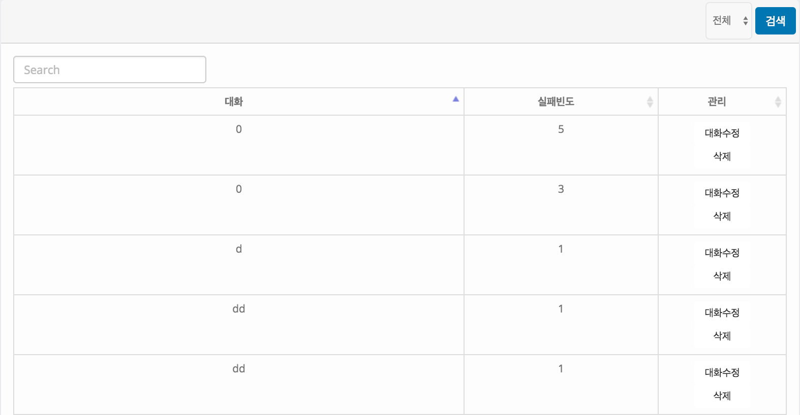

### 인텐트 대화학습
의도분석 대화학습에서는, 대화가 실패했을 때, 인텐트를 모아 보여줍니다. (대화 실패 : 기본 Dialog 발생)  
표의 실패 인텐트는 "추천 인텐트"를 뜻합니다. 오른쪽의 대화 수정 버튼을 누르면, 실패한 인텐트 들이 나옵니다. 실패한 인텐트들 중 추천 인텐트와 같은 의미를 가진다고 판단되는 것들을 체크하여 추가하면, 인텐트가 업데이트 됩니다.

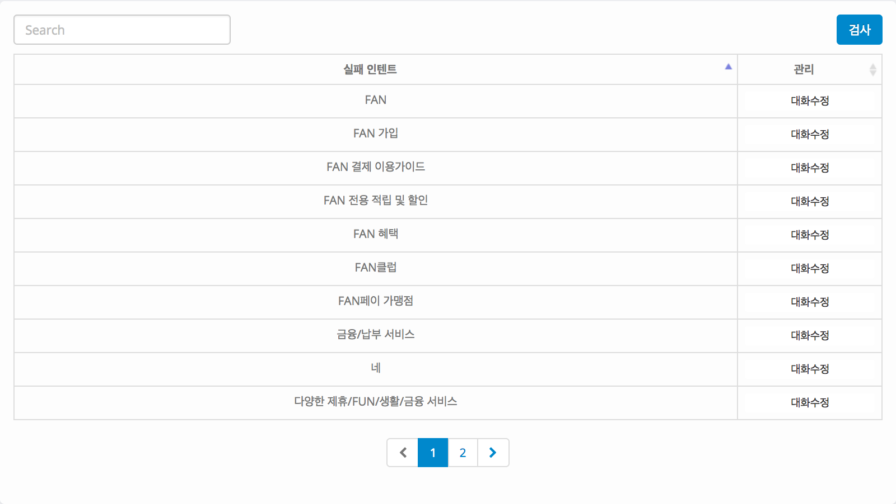

### Dashboard
봇에 대한 전반적인 Analytics를 보여주는 대쉬보드입니다.  

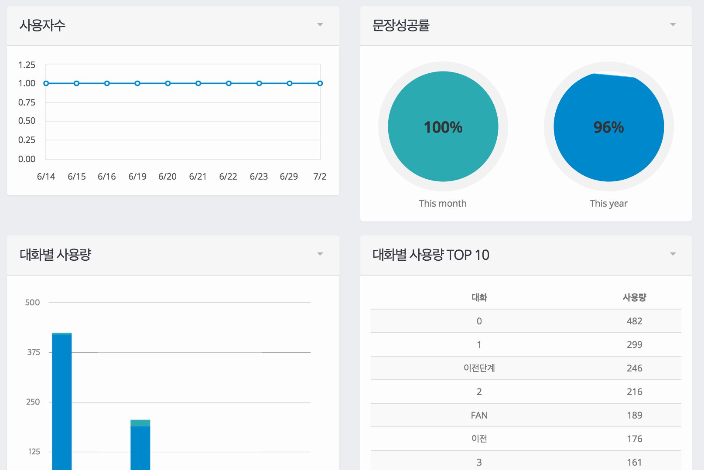

### 사용자 관리
봇과 대화한 사용자를 확인 할 수 있습니다. 사용자가 봇과 대화한 기록 또한 확인 가능합니다.

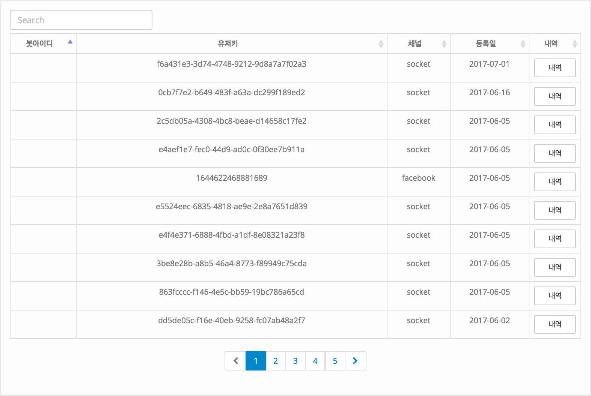

### 사용자수 분석
일별 사용자수를 보여주는 분석 창입니다.  

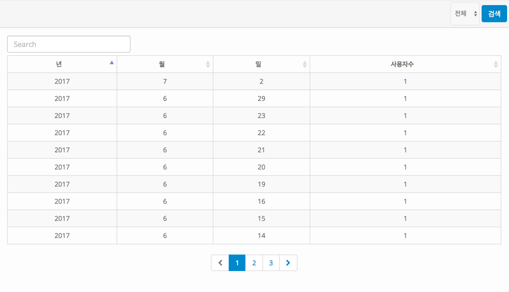

### 대화별 사용량
대화별 사용량 (사용자 input)을 보여주는 분석 창입니다.  

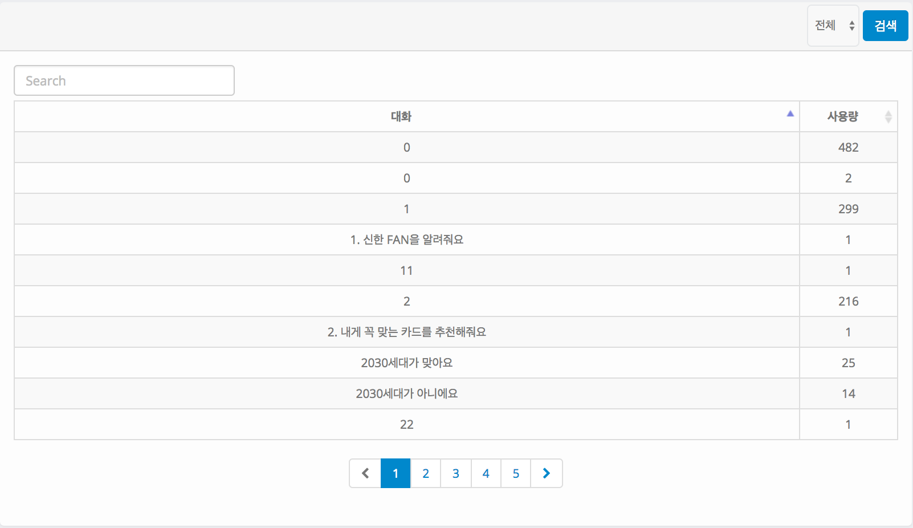

### 문장 성공률
월별 문장 성공률을 보여주는 분석 창입니다.  

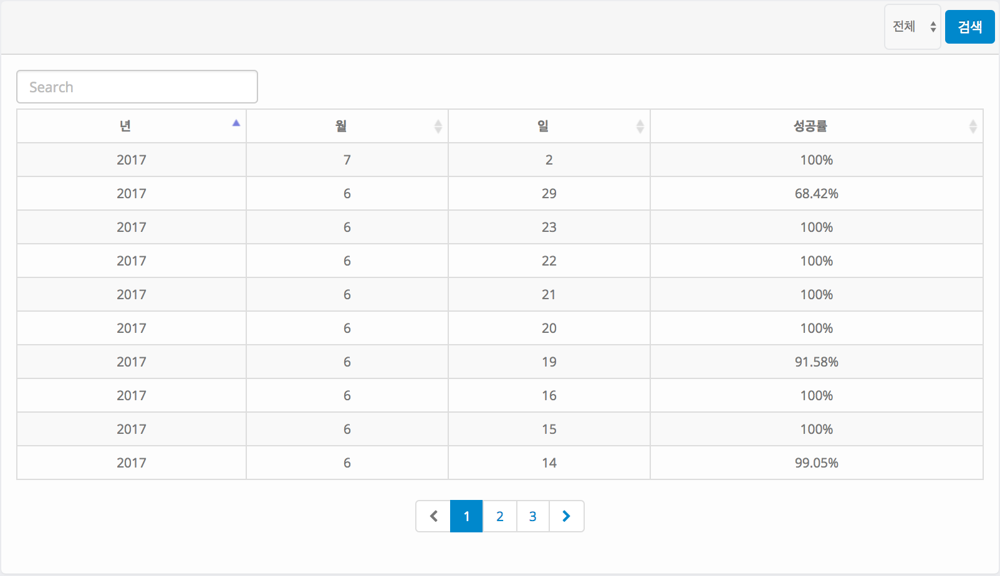


 
